```mermaid
flowchart TB
    subgraph current["TaskListProcessor.Console.csproj"]
        MAIN["<b>📦&nbsp;TaskListProcessor.Console.csproj</b><br/><small>net9.0</small>"]
        click MAIN "#examplestasklistprocessorconsoletasklistprocessorconsolecsproj"
    end
    subgraph downstream["Dependencies (3"]
        P1["<b>📦&nbsp;TaskListProcessing.csproj</b><br/><small>net9.0</small>"]
        P2["<b>📦&nbsp;CityWeatherService.csproj</b><br/><small>net9.0</small>"]
        P5["<b>📦&nbsp;CityThingsToDo.csproj</b><br/><small>net9.0</small>"]
        click P1 "#srctasklistprocessingtasklistprocessingcsproj"
        click P2 "#srccityweatherservicecityweatherservicecsproj"
        click P5 "#srccitythingstodocitythingstodocsproj"
    end
    MAIN --> P1
    MAIN --> P2
    MAIN --> P5

```

```mermaid
flowchart TB
    subgraph upstream["Dependants (3)"]
        P4["<b>📦&nbsp;TaskListProcessor.Console.csproj</b><br/><small>net9.0</small>"]
        P6["<b>📦&nbsp;CityThingsToDo.Tests.csproj</b><br/><small>net9.0</small>"]
        P8["<b>📦&nbsp;TaskListProcessor.Web.csproj</b><br/><small>net9.0</small>"]
        click P4 "#examplestasklistprocessorconsoletasklistprocessorconsolecsproj"
        click P6 "#testscitythingstodotestscitythingstodotestscsproj"
        click P8 "#examplestasklistprocessorwebtasklistprocessorwebcsproj"
    end
    subgraph current["CityThingsToDo.csproj"]
        MAIN["<b>📦&nbsp;CityThingsToDo.csproj</b><br/><small>net9.0</small>"]
        click MAIN "#srccitythingstodocitythingstodocsproj"
    end
    P4 --> MAIN
    P6 --> MAIN
    P8 --> MAIN

```

```mermaid
flowchart TB
    subgraph upstream["Dependants (3)"]
        P3["<b>📦&nbsp;CityWeatherService.Tests.csproj</b><br/><small>net9.0</small>"]
        P4["<b>📦&nbsp;TaskListProcessor.Console.csproj</b><br/><small>net9.0</small>"]
        P8["<b>📦&nbsp;TaskListProcessor.Web.csproj</b><br/><small>net9.0</small>"]
        click P3 "#testscityweatherservicetestscityweatherservicetestscsproj"
        click P4 "#examplestasklistprocessorconsoletasklistprocessorconsolecsproj"
        click P8 "#examplestasklistprocessorwebtasklistprocessorwebcsproj"
    end
    subgraph current["CityWeatherService.csproj"]
        MAIN["<b>📦&nbsp;CityWeatherService.csproj</b><br/><small>net9.0</small>"]
        click MAIN "#srccityweatherservicecityweatherservicecsproj"
    end
    P3 --> MAIN
    P4 --> MAIN
    P8 --> MAIN

```

```mermaid
flowchart TB
    subgraph upstream["Dependants (3)"]
        P4["<b>📦&nbsp;TaskListProcessor.Console.csproj</b><br/><small>net9.0</small>"]
        P7["<b>📦&nbsp;TaskListProcessing.Tests.csproj</b><br/><small>net9.0</small>"]
        P8["<b>📦&nbsp;TaskListProcessor.Web.csproj</b><br/><small>net9.0</small>"]
        click P4 "#examplestasklistprocessorconsoletasklistprocessorconsolecsproj"
        click P7 "#teststasklistprocessingteststasklistprocessingtestscsproj"
        click P8 "#examplestasklistprocessorwebtasklistprocessorwebcsproj"
    end
    subgraph current["TaskListProcessing.csproj"]
        MAIN["<b>📦&nbsp;TaskListProcessing.csproj</b><br/><small>net9.0</small>"]
        click MAIN "#srctasklistprocessingtasklistprocessingcsproj"
    end
    P4 --> MAIN
    P7 --> MAIN
    P8 --> MAIN

```

```mermaid
flowchart TB
    subgraph current["CityThingsToDo.Tests.csproj"]
        MAIN["<b>📦&nbsp;CityThingsToDo.Tests.csproj</b><br/><small>net9.0</small>"]
        click MAIN "#testscitythingstodotestscitythingstodotestscsproj"
    end
    subgraph downstream["Dependencies (1"]
        P5["<b>📦&nbsp;CityThingsToDo.csproj</b><br/><small>net9.0</small>"]
        click P5 "#srccitythingstodocitythingstodocsproj"
    end
    MAIN --> P5

```

```mermaid
flowchart TB
    subgraph current["CityWeatherService.Tests.csproj"]
        MAIN["<b>📦&nbsp;CityWeatherService.Tests.csproj</b><br/><small>net9.0</small>"]
        click MAIN "#testscityweatherservicetestscityweatherservicetestscsproj"
    end
    subgraph downstream["Dependencies (1"]
        P2["<b>📦&nbsp;CityWeatherService.csproj</b><br/><small>net9.0</small>"]
        click P2 "#srccityweatherservicecityweatherservicecsproj"
    end
    MAIN --> P2

```

```mermaid
flowchart TB
    subgraph current["TaskListProcessing.Tests.csproj"]
        MAIN["<b>📦&nbsp;TaskListProcessing.Tests.csproj</b><br/><small>net9.0</small>"]
        click MAIN "#teststasklistprocessingteststasklistprocessingtestscsproj"
    end
    subgraph downstream["Dependencies (1"]
        P1["<b>📦&nbsp;TaskListProcessing.csproj</b><br/><small>net9.0</small>"]
        click P1 "#srctasklistprocessingtasklistprocessingcsproj"
    end
    MAIN --> P1

```

# Projects and dependencies analysis

This document provides a comprehensive overview of the projects and their dependencies in the context of upgrading to .NET 9.0.

## Table of Contents

- [Projects Relationship Graph](#projects-relationship-graph)
- [Project Details](#project-details)

  - [examples\TaskListProcessor.Console\TaskListProcessor.Console.csproj](#examplestasklistprocessorconsoletasklistprocessorconsolecsproj)
  - [examples\TaskListProcessor.Web\TaskListProcessor.Web.csproj](#examplestasklistprocessorwebtasklistprocessorwebcsproj)
  - [src\CityThingsToDo\CityThingsToDo.csproj](#srccitythingstodocitythingstodocsproj)
  - [src\CityWeatherService\CityWeatherService.csproj](#srccityweatherservicecityweatherservicecsproj)
  - [src\TaskListProcessing\TaskListProcessing.csproj](#srctasklistprocessingtasklistprocessingcsproj)
  - [tests\CityThingsToDo.Tests\CityThingsToDo.Tests.csproj](#testscitythingstodotestscitythingstodotestscsproj)
  - [tests\CityWeatherService.Tests\CityWeatherService.Tests.csproj](#testscityweatherservicetestscityweatherservicetestscsproj)
  - [tests\TaskListProcessing.Tests\TaskListProcessing.Tests.csproj](#teststasklistprocessingteststasklistprocessingtestscsproj)
- [Aggregate NuGet packages details](#aggregate-nuget-packages-details)

## Projects Relationship Graph

Legend:
📦 SDK-style project
⚙️ Classic project

```mermaid
flowchart LR
    P1["<b>📦&nbsp;TaskListProcessing.csproj</b><br/><small>net9.0</small>"]
    P2["<b>📦&nbsp;CityWeatherService.csproj</b><br/><small>net9.0</small>"]
    P3["<b>📦&nbsp;CityWeatherService.Tests.csproj</b><br/><small>net9.0</small>"]
    P4["<b>📦&nbsp;TaskListProcessor.Console.csproj</b><br/><small>net9.0</small>"]
    P5["<b>📦&nbsp;CityThingsToDo.csproj</b><br/><small>net9.0</small>"]
    P6["<b>📦&nbsp;CityThingsToDo.Tests.csproj</b><br/><small>net9.0</small>"]
    P7["<b>📦&nbsp;TaskListProcessing.Tests.csproj</b><br/><small>net9.0</small>"]
    P8["<b>📦&nbsp;TaskListProcessor.Web.csproj</b><br/><small>net9.0</small>"]
    P3 --> P2
    P4 --> P1
    P4 --> P2
    P4 --> P5
    P6 --> P5
    P7 --> P1
    P8 --> P1
    P8 --> P2
    P8 --> P5
    click P1 "#srctasklistprocessingtasklistprocessingcsproj"
    click P2 "#srccityweatherservicecityweatherservicecsproj"
    click P3 "#testscityweatherservicetestscityweatherservicetestscsproj"
    click P4 "#examplestasklistprocessorconsoletasklistprocessorconsolecsproj"
    click P5 "#srccitythingstodocitythingstodocsproj"
    click P6 "#testscitythingstodotestscitythingstodotestscsproj"
    click P7 "#teststasklistprocessingteststasklistprocessingtestscsproj"
    click P8 "#examplestasklistprocessorwebtasklistprocessorwebcsproj"

```

## Project Details

### examples\TaskListProcessor.Console\TaskListProcessor.Console.csproj

#### Project Info

- **Current Target Framework:** net9.0
- **Proposed Target Framework:** net10.0
- **SDK-style**: True
- **Project Kind:** DotNetCoreApp
- **Dependencies**: 3
- **Dependants**: 0
- **Number of Files**: 5
- **Lines of Code**: 617

#### Dependency Graph

Legend:
📦 SDK-style project
⚙️ Classic project

#### Project Package References

| Package | Type | Current Version | Suggested Version | Description |
| :--- | :---: | :---: | :---: | :--- |
| Microsoft.Extensions.Logging | Explicit | 9.0.8 | 10.0.0 | NuGet package upgrade is recommended |
| Microsoft.Extensions.Logging.Console | Explicit | 9.0.8 | 10.0.0 | NuGet package upgrade is recommended |
| Newtonsoft.Json | Explicit | 13.0.3 | 13.0.4 | NuGet package upgrade is recommended |
| System.Diagnostics.DiagnosticSource | Explicit | 9.0.8 | 10.0.0 | NuGet package upgrade is recommended |
| System.Text.Json | Explicit | 9.0.8 | 10.0.0 | NuGet package upgrade is recommended |

### examples\TaskListProcessor.Web\TaskListProcessor.Web.csproj

#### Project Info

- **Current Target Framework:** net9.0
- **Proposed Target Framework:** net10.0
- **SDK-style**: True
- **Project Kind:** AspNetCore
- **Dependencies**: 3
- **Dependants**: 0
- **Number of Files**: 34
- **Lines of Code**: 5859

#### Dependency Graph

Legend:
📦 SDK-style project
⚙️ Classic project

#### Project Package References

| Package | Type | Current Version | Suggested Version | Description |
| :--- | :---: | :---: | :---: | :--- |
| Microsoft.Extensions.Logging | Explicit | 9.0.8 | 10.0.0 | NuGet package upgrade is recommended |
| Microsoft.Extensions.Logging.Console | Explicit | 9.0.8 | 10.0.0 | NuGet package upgrade is recommended |
| Newtonsoft.Json | Explicit | 13.0.3 | 13.0.4 | NuGet package upgrade is recommended |
| System.Diagnostics.DiagnosticSource | Explicit | 9.0.8 | 10.0.0 | NuGet package upgrade is recommended |
| System.Text.Json | Explicit | 9.0.8 | 10.0.0 | NuGet package upgrade is recommended |

### src\CityThingsToDo\CityThingsToDo.csproj

#### Project Info

- **Current Target Framework:** net9.0
- **Proposed Target Framework:** net10.0
- **SDK-style**: True
- **Project Kind:** ClassLibrary
- **Dependencies**: 0
- **Dependants**: 3
- **Number of Files**: 1
- **Lines of Code**: 129

#### Dependency Graph

Legend:
📦 SDK-style project
⚙️ Classic project

#### Project Package References

| Package | Type | Current Version | Suggested Version | Description |
| :--- | :---: | :---: | :---: | :--- |

### src\CityWeatherService\CityWeatherService.csproj

#### Project Info

- **Current Target Framework:** net9.0
- **Proposed Target Framework:** net10.0
- **SDK-style**: True
- **Project Kind:** ClassLibrary
- **Dependencies**: 0
- **Dependants**: 3
- **Number of Files**: 1
- **Lines of Code**: 101

#### Dependency Graph

Legend:
📦 SDK-style project
⚙️ Classic project

#### Project Package References

| Package | Type | Current Version | Suggested Version | Description |
| :--- | :---: | :---: | :---: | :--- |

### src\TaskListProcessing\TaskListProcessing.csproj

#### Project Info

- **Current Target Framework:** net9.0
- **Proposed Target Framework:** net10.0
- **SDK-style**: True
- **Project Kind:** ClassLibrary
- **Dependencies**: 0
- **Dependants**: 3
- **Number of Files**: 69
- **Lines of Code**: 7831

#### Dependency Graph

Legend:
📦 SDK-style project
⚙️ Classic project

#### Project Package References

| Package | Type | Current Version | Suggested Version | Description |
| :--- | :---: | :---: | :---: | :--- |
| BenchmarkDotNet | Explicit | 0.15.2 |  | ✅Compatible |
| BenchmarkDotNet.Diagnostics.Windows | Explicit | 0.15.2 |  | ✅Compatible |
| Microsoft.AspNetCore.Http.Abstractions | Explicit | 2.3.0 |  | ✅Compatible |
| Microsoft.AspNetCore.Mvc.Core | Explicit | 2.3.0 |  | ✅Compatible |
| Microsoft.Extensions.DependencyInjection.Abstractions | Explicit | 9.0.8 | 10.0.0 | NuGet package upgrade is recommended |
| Microsoft.Extensions.Diagnostics.HealthChecks | Explicit | 9.0.8 | 10.0.0 | NuGet package upgrade is recommended |
| Microsoft.Extensions.Diagnostics.HealthChecks.Abstractions | Explicit | 9.0.8 | 10.0.0 | NuGet package upgrade is recommended |
| Microsoft.Extensions.Hosting.Abstractions | Explicit | 9.0.8 | 10.0.0 | NuGet package upgrade is recommended |
| Microsoft.Extensions.Logging | Explicit | 9.0.8 | 10.0.0 | NuGet package upgrade is recommended |
| Microsoft.Extensions.Logging.Abstractions | Explicit | 9.0.8 | 10.0.0 | NuGet package upgrade is recommended |
| Microsoft.Extensions.Logging.Console | Explicit | 9.0.8 | 10.0.0 | NuGet package upgrade is recommended |
| Microsoft.Extensions.ObjectPool | Explicit | 9.0.8 | 10.0.0 | NuGet package upgrade is recommended |
| Microsoft.Extensions.Options | Explicit | 9.0.8 | 10.0.0 | NuGet package upgrade is recommended |
| Microsoft.Extensions.Options.ConfigurationExtensions | Explicit | 9.0.8 | 10.0.0 | NuGet package upgrade is recommended |
| Newtonsoft.Json | Explicit | 13.0.3 | 13.0.4 | NuGet package upgrade is recommended |
| OpenTelemetry | Explicit | 1.12.0 |  | ✅Compatible |
| OpenTelemetry.Extensions.Hosting | Explicit | 1.12.0 |  | ✅Compatible |
| System.Diagnostics.DiagnosticSource | Explicit | 9.0.8 | 10.0.0 | NuGet package upgrade is recommended |
| System.Text.Json | Explicit | 9.0.8 | 10.0.0 | NuGet package upgrade is recommended |
| System.Threading.Channels | Explicit | 9.0.8 | 10.0.0 | NuGet package upgrade is recommended |

### tests\CityThingsToDo.Tests\CityThingsToDo.Tests.csproj

#### Project Info

- **Current Target Framework:** net9.0
- **Proposed Target Framework:** net10.0
- **SDK-style**: True
- **Project Kind:** DotNetCoreApp
- **Dependencies**: 1
- **Dependants**: 0
- **Number of Files**: 4
- **Lines of Code**: 54

#### Dependency Graph

Legend:
📦 SDK-style project
⚙️ Classic project

#### Project Package References

| Package | Type | Current Version | Suggested Version | Description |
| :--- | :---: | :---: | :---: | :--- |
| coverlet.collector | Explicit | 6.0.4 |  | ✅Compatible |
| Microsoft.NET.Test.Sdk | Explicit | 17.14.1 |  | ✅Compatible |
| MSTest.TestAdapter | Explicit | 3.10.4 |  | ✅Compatible |
| MSTest.TestFramework | Explicit | 3.10.4 |  | ✅Compatible |
| System.Diagnostics.DiagnosticSource | Explicit | 9.0.8 | 10.0.0 | NuGet package upgrade is recommended |

### tests\CityWeatherService.Tests\CityWeatherService.Tests.csproj

#### Project Info

- **Current Target Framework:** net9.0
- **Proposed Target Framework:** net10.0
- **SDK-style**: True
- **Project Kind:** DotNetCoreApp
- **Dependencies**: 1
- **Dependants**: 0
- **Number of Files**: 4
- **Lines of Code**: 69

#### Dependency Graph

Legend:
📦 SDK-style project
⚙️ Classic project

#### Project Package References

| Package | Type | Current Version | Suggested Version | Description |
| :--- | :---: | :---: | :---: | :--- |
| coverlet.collector | Explicit | 6.0.4 |  | ✅Compatible |
| Microsoft.NET.Test.Sdk | Explicit | 17.14.1 |  | ✅Compatible |
| MSTest.TestAdapter | Explicit | 3.10.4 |  | ✅Compatible |
| MSTest.TestFramework | Explicit | 3.10.4 |  | ✅Compatible |
| System.Diagnostics.DiagnosticSource | Explicit | 9.0.8 | 10.0.0 | NuGet package upgrade is recommended |

### tests\TaskListProcessing.Tests\TaskListProcessing.Tests.csproj

#### Project Info

- **Current Target Framework:** net9.0
- **Proposed Target Framework:** net10.0
- **SDK-style**: True
- **Project Kind:** DotNetCoreApp
- **Dependencies**: 1
- **Dependants**: 0
- **Number of Files**: 10
- **Lines of Code**: 2272

#### Dependency Graph

Legend:
📦 SDK-style project
⚙️ Classic project

#### Project Package References

| Package | Type | Current Version | Suggested Version | Description |
| :--- | :---: | :---: | :---: | :--- |
| Microsoft.Extensions.Logging | Explicit | 9.0.8 | 10.0.0 | NuGet package upgrade is recommended |
| Microsoft.NET.Test.Sdk | Explicit | 17.14.1 |  | ✅Compatible |
| Moq | Explicit | 4.20.72 |  | ✅Compatible |
| MSTest.TestAdapter | Explicit | 3.10.4 |  | ✅Compatible |
| MSTest.TestFramework | Explicit | 3.10.4 |  | ✅Compatible |
| System.Diagnostics.DiagnosticSource | Explicit | 9.0.8 | 10.0.0 | NuGet package upgrade is recommended |
| System.Text.Json | Explicit | 9.0.8 | 10.0.0 | NuGet package upgrade is recommended |

## Aggregate NuGet packages details

| Package | Current Version | Suggested Version | Projects | Description |
| :--- | :---: | :---: | :--- | :--- |
| BenchmarkDotNet | 0.15.2 |  | [TaskListProcessing.csproj](#tasklistprocessingcsproj) | ✅Compatible |
| BenchmarkDotNet.Diagnostics.Windows | 0.15.2 |  | [TaskListProcessing.csproj](#tasklistprocessingcsproj) | ✅Compatible |
| coverlet.collector | 6.0.4 |  | [CityThingsToDo.Tests.csproj](#citythingstodotestscsproj) [CityWeatherService.Tests.csproj](#cityweatherservicetestscsproj) | ✅Compatible |
| Microsoft.AspNetCore.Http.Abstractions | 2.3.0 |  | [TaskListProcessing.csproj](#tasklistprocessingcsproj) | ✅Compatible |
| Microsoft.AspNetCore.Mvc.Core | 2.3.0 |  | [TaskListProcessing.csproj](#tasklistprocessingcsproj) | ✅Compatible |
| Microsoft.Extensions.DependencyInjection.Abstractions | 9.0.8 | 10.0.0 | [TaskListProcessing.csproj](#tasklistprocessingcsproj) | NuGet package upgrade is recommended |
| Microsoft.Extensions.Diagnostics.HealthChecks | 9.0.8 | 10.0.0 | [TaskListProcessing.csproj](#tasklistprocessingcsproj) | NuGet package upgrade is recommended |
| Microsoft.Extensions.Diagnostics.HealthChecks.Abstractions | 9.0.8 | 10.0.0 | [TaskListProcessing.csproj](#tasklistprocessingcsproj) | NuGet package upgrade is recommended |
| Microsoft.Extensions.Hosting.Abstractions | 9.0.8 | 10.0.0 | [TaskListProcessing.csproj](#tasklistprocessingcsproj) | NuGet package upgrade is recommended |
| Microsoft.Extensions.Logging | 9.0.8 | 10.0.0 | [TaskListProcessor.Console.csproj](#tasklistprocessorconsolecsproj) [TaskListProcessor.Web.csproj](#tasklistprocessorwebcsproj) [TaskListProcessing.csproj](#tasklistprocessingcsproj) [TaskListProcessing.Tests.csproj](#tasklistprocessingtestscsproj) | NuGet package upgrade is recommended |
| Microsoft.Extensions.Logging.Abstractions | 9.0.8 | 10.0.0 | [TaskListProcessing.csproj](#tasklistprocessingcsproj) | NuGet package upgrade is recommended |
| Microsoft.Extensions.Logging.Console | 9.0.8 | 10.0.0 | [TaskListProcessor.Console.csproj](#tasklistprocessorconsolecsproj) [TaskListProcessor.Web.csproj](#tasklistprocessorwebcsproj) [TaskListProcessing.csproj](#tasklistprocessingcsproj) | NuGet package upgrade is recommended |
| Microsoft.Extensions.ObjectPool | 9.0.8 | 10.0.0 | [TaskListProcessing.csproj](#tasklistprocessingcsproj) | NuGet package upgrade is recommended |
| Microsoft.Extensions.Options | 9.0.8 | 10.0.0 | [TaskListProcessing.csproj](#tasklistprocessingcsproj) | NuGet package upgrade is recommended |
| Microsoft.Extensions.Options.ConfigurationExtensions | 9.0.8 | 10.0.0 | [TaskListProcessing.csproj](#tasklistprocessingcsproj) | NuGet package upgrade is recommended |
| Microsoft.NET.Test.Sdk | 17.14.1 |  | [CityThingsToDo.Tests.csproj](#citythingstodotestscsproj) [CityWeatherService.Tests.csproj](#cityweatherservicetestscsproj) [TaskListProcessing.Tests.csproj](#tasklistprocessingtestscsproj) | ✅Compatible |
| Moq | 4.20.72 |  | [TaskListProcessing.Tests.csproj](#tasklistprocessingtestscsproj) | ✅Compatible |
| MSTest.TestAdapter | 3.10.4 |  | [CityThingsToDo.Tests.csproj](#citythingstodotestscsproj) [CityWeatherService.Tests.csproj](#cityweatherservicetestscsproj) [TaskListProcessing.Tests.csproj](#tasklistprocessingtestscsproj) | ✅Compatible |
| MSTest.TestFramework | 3.10.4 |  | [CityThingsToDo.Tests.csproj](#citythingstodotestscsproj) [CityWeatherService.Tests.csproj](#cityweatherservicetestscsproj) [TaskListProcessing.Tests.csproj](#tasklistprocessingtestscsproj) | ✅Compatible |
| Newtonsoft.Json | 13.0.3 | 13.0.4 | [TaskListProcessor.Console.csproj](#tasklistprocessorconsolecsproj) [TaskListProcessor.Web.csproj](#tasklistprocessorwebcsproj) [TaskListProcessing.csproj](#tasklistprocessingcsproj) | NuGet package upgrade is recommended |
| OpenTelemetry | 1.12.0 |  | [TaskListProcessing.csproj](#tasklistprocessingcsproj) | ✅Compatible |
| OpenTelemetry.Extensions.Hosting | 1.12.0 |  | [TaskListProcessing.csproj](#tasklistprocessingcsproj) | ✅Compatible |
| System.Diagnostics.DiagnosticSource | 9.0.8 | 10.0.0 | [TaskListProcessor.Console.csproj](#tasklistprocessorconsolecsproj) [TaskListProcessor.Web.csproj](#tasklistprocessorwebcsproj) [TaskListProcessing.csproj](#tasklistprocessingcsproj) [CityThingsToDo.Tests.csproj](#citythingstodotestscsproj) [CityWeatherService.Tests.csproj](#cityweatherservicetestscsproj) [TaskListProcessing.Tests.csproj](#tasklistprocessingtestscsproj) | NuGet package upgrade is recommended |
| System.Text.Json | 9.0.8 | 10.0.0 | [TaskListProcessor.Console.csproj](#tasklistprocessorconsolecsproj) [TaskListProcessor.Web.csproj](#tasklistprocessorwebcsproj) [TaskListProcessing.csproj](#tasklistprocessingcsproj) [TaskListProcessing.Tests.csproj](#tasklistprocessingtestscsproj) | NuGet package upgrade is recommended |
| System.Threading.Channels | 9.0.8 | 10.0.0 | [TaskListProcessing.csproj](#tasklistprocessingcsproj) | NuGet package upgrade is recommended |

