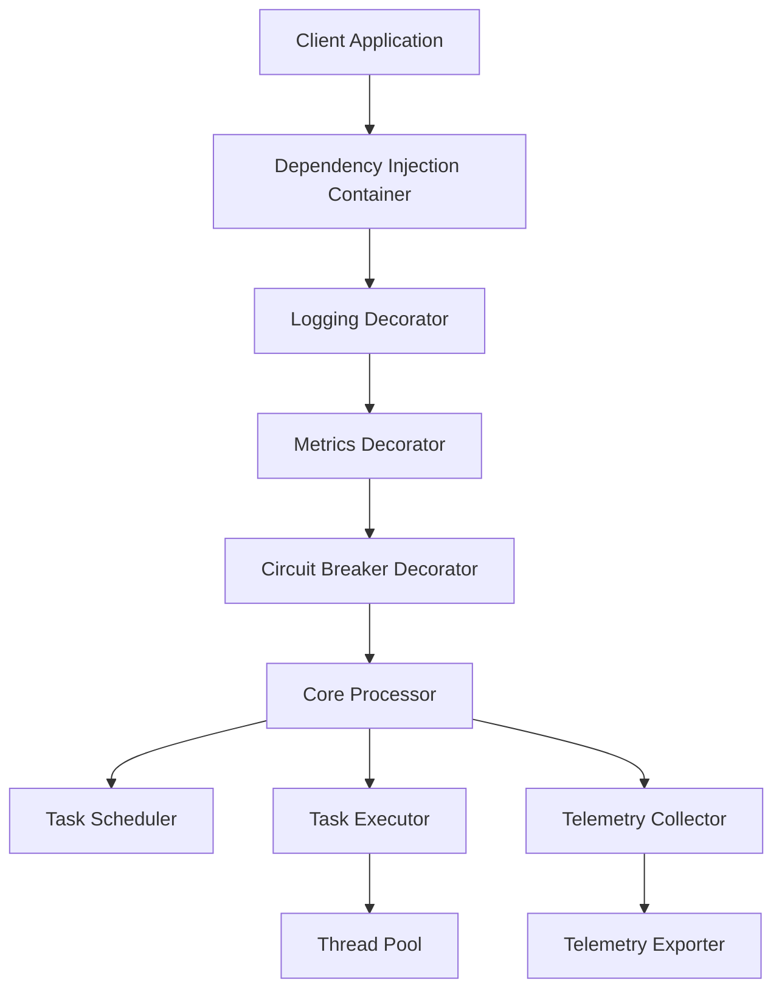

# TaskListProcessor - World-Class Demo & Education Site Improvement Plan

## Executive Summary

This plan outlines a comprehensive strategy to transform the TaskListProcessor repository into a **world-class demonstration and education platform** for asynchronous task processing best practices in .NET 10.0. The repository already has strong fundamentals with clean architecture, SOLID principles, and comprehensive features. This plan focuses on enhancing educational value, discoverability, and practical application.

---

## Current State Assessment

### ? **Strengths**

1. **Solid Architecture**
   - Clean interface segregation (ITaskProcessor, ITaskBatchProcessor, etc.)
   - SOLID principles implementation
   - Decorator pattern for cross-cutting concerns
   - Dependency injection integration
   - Modern .NET 10.0 codebase

2. **Comprehensive Features**
   - Circuit breaker pattern
   - Advanced scheduling
   - Telemetry and health monitoring
   - Memory pooling and optimization
   - OpenTelemetry integration ready

3. **Good Documentation**
   - Main README with feature overview
   - Phase 1 documentation
   - Migration guides
   - IIS deployment guide
   - Development guide

4. **Working Examples**
   - Console application demo
   - ASP.NET Core Razor Pages web application
   - Test projects with good coverage

### ?? **Areas for Improvement**

1. **Educational Content**
   - Limited tutorial content
   - No progressive learning path
   - Missing "why" explanations for architectural decisions
   - No interactive learning components

2. **Code Examples**
   - Limited variety of real-world scenarios
   - Missing anti-pattern examples
   - No before/after comparisons
   - Limited industry-specific use cases

3. **Web Demo Experience**
   - Could be more interactive and educational
   - Missing visual architecture diagrams
   - No live code playground
   - Limited scenario variety

4. **Documentation Structure**
   - Could be better organized for learning progression
   - Missing quick-start guides for different skill levels
   - No troubleshooting guides
   - Limited performance tuning guides

5. **Community Engagement**
   - No contribution guidelines specific to education
   - Missing FAQ section
   - No community examples showcase
   - Limited blog post integration

---

## Improvement Strategy

### ?? **Vision Statement**

*"Transform TaskListProcessor into the go-to educational resource for learning modern asynchronous task processing patterns in .NET, with progressive tutorials, interactive demos, real-world examples, and best-practice patterns that developers can immediately apply to production systems."*

---

## Phase 1: Foundation Enhancement (Weeks 1-2)

### 1.1 Documentation Restructure

**Goal**: Create a progressive learning experience

#### New Documentation Structure

```
docs/
??? getting-started/
?   ??? 00-README.md                        # Overview and learning paths
?   ??? 01-quick-start-5-minutes.md        # 5-minute quick start
?   ??? 02-fundamentals.md                  # Core concepts
?   ??? 03-your-first-processor.md          # First implementation
?   ??? 04-common-pitfalls.md               # Common mistakes to avoid
??? tutorials/
?   ??? beginner/
?   ?   ??? 01-simple-task-execution.md
?   ?   ??? 02-batch-processing.md
?   ?   ??? 03-error-handling.md
?   ?   ??? 04-progress-reporting.md
?   ?   ??? 05-basic-telemetry.md
?   ??? intermediate/
?   ?   ??? 01-dependency-injection.md
?   ?   ??? 02-circuit-breaker-pattern.md
?   ?   ??? 03-advanced-scheduling.md
?   ?   ??? 04-task-dependencies.md
?   ?   ??? 05-streaming-results.md
?   ?   ??? 06-custom-decorators.md
?   ??? advanced/
?       ??? 01-memory-optimization.md
?       ??? 02-load-balancing.md
?       ??? 03-opentelemetry-integration.md
?       ??? 04-custom-schedulers.md
?       ??? 05-performance-tuning.md
?       ??? 06-production-patterns.md
??? architecture/
?   ??? design-principles.md                # SOLID, DDD, etc.
?   ??? architectural-decisions.md          # ADRs (Architecture Decision Records)
?   ??? patterns-explained.md               # Decorator, Strategy, etc.
?   ??? performance-considerations.md
?   ??? scalability-guide.md
??? examples/
?   ??? real-world-scenarios/
?   ?   ??? api-aggregation.md
?   ?   ??? batch-data-processing.md
?   ?   ??? microservices-coordination.md
?   ?   ??? etl-pipelines.md
?   ?   ??? web-scraping.md
?   ?   ??? notification-system.md
?   ??? industry-specific/
?   ?   ??? ecommerce-order-processing.md
?   ?   ??? financial-transaction-processing.md
?   ?   ??? healthcare-data-integration.md
?   ?   ??? iot-data-aggregation.md
?   ??? anti-patterns/
?       ??? what-not-to-do.md
?       ??? common-mistakes.md
?       ??? refactoring-examples.md
??? api-reference/
?   ??? interfaces/
?   ?   ??? ITaskProcessor.md
?   ?   ??? ITaskBatchProcessor.md
?   ?   ??? ITaskStreamProcessor.md
?   ?   ??? ITaskTelemetryProvider.md
?   ??? decorators/
?   ??? models/
?   ??? extensions/
??? best-practices/
?   ??? async-await-patterns.md
?   ??? error-handling-strategies.md
?   ??? testing-strategies.md
?   ??? monitoring-and-observability.md
?   ??? security-considerations.md
?   ??? production-checklist.md
??? troubleshooting/
?   ??? common-issues.md
?   ??? debugging-guide.md
?   ??? performance-issues.md
?   ??? faq.md
??? contributing/
    ??? how-to-contribute.md
    ??? code-style-guide.md
    ??? documentation-guide.md
    ??? example-submission-guide.md
```

#### Action Items

- [ ] Create progressive learning path documentation
- [ ] Write beginner, intermediate, and advanced tutorials
- [ ] Document architectural decisions (ADRs)
- [ ] Create comprehensive API reference
- [ ] Add troubleshooting guides and FAQ
- [ ] Write best practices guides

### 1.2 Quick Start Guides

#### 5-Minute Quick Start

```markdown
# 5-Minute Quick Start

## Install

```bash
dotnet new console -n MyTaskProcessor
cd MyTaskProcessor
dotnet add package TaskListProcessor
```

## Write Code

```csharp
using TaskListProcessing.Core;

using var processor = new TaskListProcessorEnhanced("Quick Demo", null);

var tasks = new Dictionary<string, Func<CancellationToken, Task<object?>>>
{
    ["Fetch Data"] = async ct => await FetchDataAsync(),
    ["Process Data"] = async ct => await ProcessDataAsync(),
    ["Save Results"] = async ct => await SaveResultsAsync()
};

await processor.ProcessTasksAsync(tasks);

// View results
foreach (var result in processor.TaskResults)
{
    Console.WriteLine($"{result.Name}: {result.IsSuccessful}");
}
```

## Run

```bash
dotnet run
```

**Next Steps**: [Full Tutorial ?](tutorials/beginner/01-simple-task-execution.md)
```

#### Action Items

- [ ] Create 5-minute quick start
- [ ] Create 30-minute guided tutorial
- [ ] Create skill-level specific entry points
- [ ] Add "Next Steps" links for progression

---

## Phase 2: Interactive Web Experience (Weeks 3-4)

### 2.1 Enhanced Web Demo

**Goal**: Transform the web application into an interactive learning platform

#### New Features

1. **Interactive Code Playground**
   - Monaco Editor integration for live C# code editing
   - Real-time execution with result visualization
   - Pre-loaded example scenarios
   - Save and share code snippets

2. **Visual Architecture Explorer**
   - Interactive component diagrams using Mermaid.js
   - Click-through component exploration
   - Animated execution flow visualization
   - Pattern explanation overlays

3. **Scenario Library**
   - **Beginner Scenarios**
     - Simple task execution
     - Basic error handling
     - Progress reporting
   - **Intermediate Scenarios**
     - Dependency resolution
     - Circuit breaker in action
     - Retry policies
     - Streaming results
   - **Advanced Scenarios**
     - Load balancing strategies
     - Memory pressure handling
     - Custom schedulers
     - Performance optimization

4. **Learning Modules**
   - Step-by-step guided tours
   - Interactive quizzes
   - Challenge exercises
   - Achievement badges

5. **Performance Benchmarks Dashboard**
   - Live benchmark results
   - Comparative analysis charts
   - Memory usage visualization
   - Throughput metrics

#### Web Application Structure

```
examples/TaskListProcessor.Web/
??? Pages/
?   ??? Learn/
?   ?   ??? Index.cshtml                    # Learning hub
?   ?   ??? GettingStarted.cshtml           # Getting started guide
?   ?   ??? Tutorials.cshtml                # Tutorial index
?   ?   ??? Playground.cshtml               # Code playground
?   ??? Examples/
?   ?   ??? Index.cshtml                    # Example gallery
?   ?   ??? Beginner.cshtml                 # Beginner examples
?   ?   ??? Intermediate.cshtml             # Intermediate examples
?   ?   ??? Advanced.cshtml                 # Advanced examples
?   ??? Architecture/
?   ?   ??? Index.cshtml                    # Architecture overview
?   ?   ??? Components.cshtml               # Component explorer
?   ?   ??? Patterns.cshtml                 # Design patterns
?   ?   ??? Flow.cshtml                     # Execution flow visualizer
?   ??? Performance/
?   ?   ??? Index.cshtml                    # Performance dashboard
?   ?   ??? Benchmarks.cshtml               # Benchmark results
?   ?   ??? Optimization.cshtml             # Optimization guide
?   ??? Community/
?       ??? Index.cshtml                    # Community showcase
?       ??? Examples.cshtml                 # User-submitted examples
?       ??? Contribute.cshtml               # Contribution guide
??? Components/
?   ??? CodeEditor/                         # Monaco editor component
?   ??? DiagramViewer/                      # Mermaid diagram component
?   ??? BenchmarkChart/                     # Chart.js benchmark charts
?   ??? ProgressiveDisclosure/              # Learning components
??? wwwroot/
    ??? js/
    ?   ??? playground.js                   # Code playground logic
    ?   ??? architecture-explorer.js        # Architecture visualization
    ?   ??? learning-modules.js             # Interactive learning
    ??? css/
        ??? learning.css                    # Educational styling
```

#### Action Items

- [ ] Implement code playground with Monaco Editor
- [ ] Create interactive architecture diagrams
- [ ] Build scenario library with progressive difficulty
- [ ] Add learning modules with guided tours
- [ ] Create performance benchmark dashboard
- [ ] Implement save/share functionality

### 2.2 Visual Learning Aids

#### Mermaid Diagrams

1. **Architecture Overview**


2. **Execution Flow**
3. **Decorator Chain**
4. **Dependency Resolution**

#### Action Items

- [ ] Create comprehensive diagram library
- [ ] Add interactive diagram explorer
- [ ] Implement animation for execution flow
- [ ] Create printable architecture posters

---

## Phase 3: Real-World Examples (Weeks 5-6)

### 3.1 Production-Ready Examples

**Goal**: Provide complete, deployable examples for common scenarios

#### Example Projects Structure

```
examples/
??? BasicExamples/
?   ??? 01-HelloWorld/
?   ??? 02-ErrorHandling/
?   ??? 03-ProgressReporting/
?   ??? 04-Cancellation/
??? RealWorldScenarios/
?   ??? ApiAggregation/
?   ?   ??? README.md
?   ?   ??? ApiAggregation.sln
?   ?   ??? src/
?   ?   ?   ??? ApiAggregation.Core/
?   ?   ?   ??? ApiAggregation.Services/
?   ?   ?   ??? ApiAggregation.Api/
?   ?   ??? tests/
?   ??? BatchDataProcessing/
?   ?   ??? README.md
?   ?   ??? BatchDataProcessing.sln
?   ?   ??? ... (full project structure)
?   ??? MicroservicesCoordination/
?   ??? ETLPipeline/
?   ??? WebScraping/
?   ??? NotificationSystem/
??? IndustrySpecific/
?   ??? ECommerce/
?   ?   ??? OrderProcessing/
?   ?   ??? InventorySync/
?   ?   ??? PriceAggregation/
?   ??? Financial/
?   ?   ??? TransactionProcessing/
?   ?   ??? RiskCalculation/
?   ?   ??? ReportGeneration/
?   ??? Healthcare/
?   ?   ??? DataIntegration/
?   ?   ??? PatientDataAggregation/
?   ?   ??? ComplianceReporting/
?   ??? IoT/
?       ??? DataAggregation/
?       ??? DeviceMonitoring/
?       ??? AlertProcessing/
??? PerformanceOptimization/
?   ??? MemoryOptimization/
?   ??? HighThroughput/
?   ??? LowLatency/
?   ??? ResourceConstrained/
??? AntiPatterns/
    ??? BlockingCalls/
    ??? ExcessiveRetries/
    ??? MemoryLeaks/
    ??? DeadlockScenarios/
```

#### Example Template

Each example should include:

1. **README.md** with:
   - Problem statement
   - Solution approach
   - Key learnings
   - Code walkthrough
   - Deployment instructions
   - Troubleshooting tips

2. **Complete working solution**
3. **Unit and integration tests**
4. **Performance benchmarks**
5. **Docker compose for dependencies**
6. **Production deployment guide**

#### Action Items

- [ ] Create 6 real-world scenario examples
- [ ] Create 4 industry-specific examples
- [ ] Create 3 performance optimization examples
- [ ] Document 5 anti-patterns with fixes
- [ ] Add Docker support for all examples
- [ ] Create video walkthroughs (optional)

### 3.2 Code Snippets Library

#### Snippet Categories

```
snippets/
??? basic/
?   ??? simple-task.md
?   ??? batch-processing.md
?   ??? error-handling.md
?   ??? progress-reporting.md
??? patterns/
?   ??? retry-policy.md
?   ??? circuit-breaker.md
?   ??? bulkhead-pattern.md
?   ??? saga-pattern.md
??? integration/
?   ??? dependency-injection.md
?   ??? aspnet-core.md
?   ??? hangfire-integration.md
?   ??? quartz-integration.md
??? testing/
    ??? unit-testing.md
    ??? integration-testing.md
    ??? mocking.md
    ??? performance-testing.md
```

#### Action Items

- [ ] Create 50+ categorized code snippets
- [ ] Add "Try in Playground" links
- [ ] Include performance metrics
- [ ] Add copy-to-clipboard functionality

---

## Phase 4: Testing & Validation Excellence (Weeks 7-8)

### 4.1 Comprehensive Test Suite

**Goal**: Demonstrate testing best practices

#### Test Project Structure

```
tests/
??? TaskListProcessing.Tests/
?   ??? Unit/
?   ?   ??? Core/
?   ?   ??? Decorators/
?   ?   ??? Scheduling/
?   ?   ??? Telemetry/
?   ??? Integration/
?   ?   ??? EndToEnd/
?   ?   ??? DependencyInjection/
?   ?   ??? Scenarios/
?   ??? Performance/
?   ?   ??? Benchmarks/
?   ?   ??? LoadTests/
?   ?   ??? StressTests/
?   ??? Documentation/
?       ??? TestExamples.cs                 # Tests as documentation
??? Examples.Tests/
?   ??? RealWorldScenarios.Tests/
?   ??? IndustrySpecific.Tests/
??? TestUtilities/
    ??? Builders/                           # Test data builders
    ??? Fixtures/                           # Test fixtures
    ??? Helpers/                            # Test helpers
```

#### Testing Documentation

```
docs/testing/
??? unit-testing-guide.md
??? integration-testing-guide.md
??? performance-testing-guide.md
??? mocking-strategies.md
??? test-data-management.md
??? ci-cd-integration.md
```

#### Action Items

- [ ] Achieve 90%+ code coverage
- [ ] Add performance benchmarks using BenchmarkDotNet
- [ ] Create test-as-documentation examples
- [ ] Add mutation testing
- [ ] Create testing best practices guide
- [ ] Add load testing scenarios

### 4.2 Example Test Suites

#### Unit Test Example (Test as Documentation)

```csharp
/// <summary>
/// Example: How to test basic task execution
/// This test demonstrates the recommended approach for testing
/// a simple task processor scenario.
/// </summary>
[Fact]
public async Task Example_BasicTaskExecution_ReturnsSuccess()
{
    // Arrange: Setup your processor
    var processor = new TaskListProcessorEnhanced("Test", null);
    
    // Arrange: Define your task
    var taskExecuted = false;
    var taskFactory = new Func<CancellationToken, Task<object?>>(_ =>
    {
        taskExecuted = true;
        return Task.FromResult<object?>("Success");
    });
    
    // Act: Execute the task
    var result = await processor.ExecuteTaskAsync("TestTask", taskFactory);
    
    // Assert: Verify expectations
    Assert.True(result.IsSuccessful);
    Assert.True(taskExecuted);
    Assert.Equal("Success", result.Data);
}
```

#### Action Items

- [ ] Create 20+ test-as-documentation examples
- [ ] Add inline explanations in test code
- [ ] Create test cookbooks for common scenarios
- [ ] Add performance baselines

---

## Phase 5: Advanced Features & Patterns (Weeks 9-10)

### 5.1 Advanced Pattern Examples

#### Patterns to Demonstrate

1. **Saga Pattern** - Long-running distributed transactions
2. **Bulkhead Pattern** - Fault isolation
3. **Retry with Exponential Backoff**
4. **Circuit Breaker with Fallback**
5. **Rate Limiting**
6. **Request Deduplication**
7. **Priority Queue Processing**
8. **Batch Processing with Windowing**

#### Implementation

```
examples/AdvancedPatterns/
??? SagaPattern/
?   ??? README.md
?   ??? OrderProcessingSaga/
?   ??? docs/
?       ??? pattern-explanation.md
?       ??? when-to-use.md
??? BulkheadPattern/
??? RateLimiting/
??? ... (other patterns)
```

#### Action Items

- [ ] Implement 8 advanced pattern examples
- [ ] Create pattern decision matrix
- [ ] Add visual pattern explanations
- [ ] Create pattern comparison guide

### 5.2 Integration Examples

#### Popular Framework Integrations

```
examples/Integrations/
??? AspNetCore/
?   ??? MinimalApi/
?   ??? RazorPages/
?   ??? MVC/
?   ??? BlazorServer/
??? Hangfire/
??? Quartz/
??? MassTransit/
??? OpenTelemetry/
??? ApplicationInsights/
??? Prometheus/
```

#### Action Items

- [ ] Create 6+ framework integration examples
- [ ] Add configuration guides
- [ ] Create deployment examples
- [ ] Add monitoring dashboards

---

## Phase 6: Community & Engagement (Weeks 11-12)

### 6.1 Community Features

#### GitHub Features

1. **Discussion Forums**
   - Q&A section
   - Show and Tell
   - Ideas and Feature Requests
   - Best Practices Sharing

2. **Issue Templates**
   - Bug report
   - Feature request
   - Example submission
   - Documentation improvement

3. **PR Templates**
   - Code contribution
   - Documentation contribution
   - Example contribution

#### Community Showcase

```
docs/community/
??? showcase/
?   ??? production-stories.md              # How companies use it
?   ??? community-examples/                # User-submitted examples
?   ??? blog-posts.md                      # Community blog posts
??? contributors/
?   ??? hall-of-fame.md
?   ??? contributor-guide.md
??? events/
    ??? webinars.md
    ??? workshops.md
```

#### Action Items

- [ ] Setup GitHub Discussions
- [ ] Create issue/PR templates
- [ ] Build community showcase page
- [ ] Create contributor recognition system
- [ ] Plan monthly webinars (optional)

### 6.2 External Content

#### Blog Series

1. **"Mastering Async Processing in .NET 10"** (Series of 10)
2. **"Production Patterns for Task Processing"**
3. **"Performance Optimization Deep Dive"**
4. **"Testing Strategies for Async Code"**

#### Video Content (Optional)

1. YouTube tutorial series
2. Architecture walkthrough
3. Live coding sessions
4. Performance optimization workshop

#### Action Items

- [ ] Write 10-part blog series
- [ ] Create video tutorials (if budget allows)
- [ ] Present at conferences/meetups
- [ ] Create podcast appearances

---

## Phase 7: Quality Assurance & Polish (Weeks 13-14)

### 7.1 Documentation Quality

#### Quality Checklist

- [ ] All code examples compile and run
- [ ] All links work (automated checking)
- [ ] Consistent terminology throughout
- [ ] Grammar and spell-check complete
- [ ] Code formatting consistent
- [ ] Screenshots up-to-date
- [ ] Version numbers current

#### Automated Quality Tools

```yaml
# .github/workflows/docs-quality.yml
name: Documentation Quality

on: [push, pull_request]

jobs:
  quality-check:
    runs-on: ubuntu-latest
    steps:
      - uses: actions/checkout@v3
      
      # Check links
      - name: Check links
        uses: lycheeverse/lychee-action@v1
        
      # Spell check
      - name: Spell check
        uses: streetsidesoftware/cspell-action@v2
        
      # Check code snippets compile
      - name: Validate code snippets
        run: ./scripts/validate-snippets.sh
```

#### Action Items

- [ ] Implement automated quality checks
- [ ] Run comprehensive review
- [ ] Get external feedback
- [ ] Fix all issues found

### 7.2 Performance Validation

#### Benchmarks to Include

1. **Throughput benchmarks**
2. **Latency benchmarks**
3. **Memory usage benchmarks**
4. **Scalability benchmarks**
5. **Comparison benchmarks** (vs alternatives)

#### Action Items

- [ ] Run comprehensive benchmarks
- [ ] Document all results
- [ ] Create performance comparison charts
- [ ] Add performance regression tests

---

## Phase 8: Launch & Promotion (Week 15)

### 8.1 Launch Checklist

#### Pre-Launch

- [ ] All documentation complete
- [ ] All examples working
- [ ] All tests passing
- [ ] Code coverage >90%
- [ ] Performance benchmarks documented
- [ ] Website deployed
- [ ] Community features active

#### Launch Activities

1. **Blog Post**: "Introducing TaskListProcessor v2.0"
2. **Reddit Post**: /r/dotnet, /r/programming
3. **Twitter/X Thread**: Feature showcase
4. **LinkedIn Article**: Enterprise focus
5. **Dev.to Article**: Tutorial focus
6. **Hackernews**: If appropriate

#### Post-Launch

- [ ] Monitor feedback
- [ ] Respond to issues quickly
- [ ] Engage with community
- [ ] Track analytics
- [ ] Plan next improvements

### 8.2 Success Metrics

#### Quantitative Metrics

- **GitHub Stars**: Target 500+ in first 3 months
- **Downloads**: Target 1000+ NuGet downloads/month
- **Contributors**: Target 10+ contributors
- **Documentation Views**: Track with analytics
- **Example Usage**: Track demo site visits

#### Qualitative Metrics

- Community sentiment (positive feedback)
- Quality of contributions
- Production usage stories
- Conference talk acceptances
- Blog post mentions

---

## Technical Implementation Details

### New Code Structure

```
TaskListProcessor/
??? src/
?   ??? TaskListProcessing/                 # Core library (existing)
?   ??? TaskListProcessing.Examples/        # NEW: Reusable example library
?   ?   ??? Scenarios/
?   ?   ??? Patterns/
?   ?   ??? Utilities/
?   ??? TaskListProcessing.Benchmarks/      # NEW: BenchmarkDotNet project
??? examples/
?   ??? BasicExamples/                      # NEW: Basic example projects
?   ??? RealWorldScenarios/                 # NEW: Production-ready examples
?   ??? IndustrySpecific/                   # NEW: Industry examples
?   ??? AdvancedPatterns/                   # NEW: Advanced patterns
?   ??? Integrations/                       # NEW: Framework integrations
?   ??? TaskListProcessor.Console/          # Enhanced existing
?   ??? TaskListProcessor.Web/              # Enhanced existing
??? tests/
?   ??? TaskListProcessing.Tests/           # Enhanced existing
?   ??? Examples.Tests/                     # NEW: Example tests
?   ??? Performance.Tests/                  # NEW: Performance tests
??? docs/                                   # Restructured (see Phase 1)
??? scripts/
?   ??? validate-snippets.sh               # NEW: Snippet validation
?   ??? generate-docs.sh                   # NEW: Doc generation
?   ??? run-benchmarks.sh                  # NEW: Benchmark runner
??? website/                                # NEW: Static site generator config
    ??? docusaurus.config.js               # If using Docusaurus
    ??? ... (site configuration)
```

### Technology Stack Enhancements

#### For Web Demo

- **Monaco Editor**: Code playground
- **Mermaid.js**: Architecture diagrams
- **Chart.js**: Performance charts
- **Highlight.js**: Syntax highlighting
- **Bootstrap 5**: Existing, enhance with custom components
- **SignalR**: Real-time updates (optional)

#### For Documentation

- **Docusaurus** or **VitePress**: Static site generator
- **Algolia DocSearch**: Search functionality
- **Mermaid CLI**: Generate diagram images
- **Playwright**: E2E testing for web demo

#### For Quality

- **BenchmarkDotNet**: Performance benchmarking
- **Lychee**: Link checking
- **CSpell**: Spell checking
- **SonarQube**: Code quality
- **Stryker.NET**: Mutation testing

---

## Resource Requirements

### Time Estimates

| Phase | Duration | Hours | Focus |
|-------|----------|-------|-------|
| Phase 1 | 2 weeks | 60-80 | Documentation restructure |
| Phase 2 | 2 weeks | 60-80 | Web demo enhancement |
| Phase 3 | 2 weeks | 80-100 | Real-world examples |
| Phase 4 | 2 weeks | 60-80 | Testing excellence |
| Phase 5 | 2 weeks | 80-100 | Advanced patterns |
| Phase 6 | 2 weeks | 40-60 | Community features |
| Phase 7 | 2 weeks | 40-60 | Quality assurance |
| Phase 8 | 1 week | 20-30 | Launch activities |
| **Total** | **15 weeks** | **440-590 hours** | |

### Skills Needed

- **Technical Writing**: Documentation, tutorials
- **.NET Development**: Examples, patterns
- **Frontend Development**: Web demo enhancements
- **DevOps**: CI/CD, automation
- **Design**: UI/UX, diagrams
- **Marketing**: Launch, promotion (optional)

---

## Success Criteria

### Phase Completion Criteria

Each phase is considered complete when:

1. All action items checked off
2. Code review completed
3. Tests passing (if applicable)
4. Documentation reviewed
5. Stakeholder approval (if applicable)

### Overall Success Indicators

**Short-term (3 months)**:
- ? All documentation complete and high-quality
- ? 20+ working examples across all categories
- ? Enhanced web demo live and functional
- ? 90%+ test coverage maintained
- ? 500+ GitHub stars
- ? Active community engagement

**Medium-term (6 months)**:
- ? 1000+ NuGet downloads/month
- ? 10+ contributors
- ? Featured in .NET newsletters/blogs
- ? Used in production by 5+ companies
- ? Conference talk acceptance

**Long-term (12 months)**:
- ? Industry-recognized reference implementation
- ? Mentioned in Microsoft docs/samples
- ? Active community with regular contributions
- ? Used as educational resource in courses
- ? Published book chapter or significant article

---

## Risk Management

### Potential Risks

1. **Scope Creep**
   - Mitigation: Stick to defined phases, create backlog for future ideas

2. **Resource Constraints**
   - Mitigation: Prioritize high-impact items, consider community contributions

3. **Technology Changes**
   - Mitigation: Use stable, well-supported technologies, plan for updates

4. **Low Community Engagement**
   - Mitigation: Invest in marketing, engage proactively, provide value first

5. **Quality Issues**
   - Mitigation: Comprehensive testing, peer review, automated quality checks

---

## Maintenance Plan

### Ongoing Activities

**Weekly**:
- Monitor GitHub issues/discussions
- Respond to community questions
- Review and merge PRs
- Update documentation as needed

**Monthly**:
- Review analytics and metrics
- Plan new content/examples
- Update dependencies
- Conduct link checks

**Quarterly**:
- Major feature updates
- Comprehensive documentation review
- Community survey
- Conference submissions

**Annually**:
- Major version updates
- Comprehensive architecture review
- Technology stack evaluation
- Long-term roadmap planning

---

## Conclusion

This comprehensive improvement plan transforms TaskListProcessor from a solid technical library into a **world-class educational platform** that:

1. ? **Teaches** through progressive, hands-on tutorials
2. ? **Demonstrates** best practices with real-world examples
3. ? **Engages** the community with interactive tools
4. ? **Guides** developers from beginner to expert
5. ? **Inspires** through production-ready patterns

By following this plan, TaskListProcessor will become the **go-to resource** for learning modern asynchronous task processing in .NET, benefiting thousands of developers and establishing itself as an industry-standard reference implementation.

---

## Next Steps

1. **Review** this plan with stakeholders
2. **Prioritize** phases based on resources and goals
3. **Create** detailed task breakdown for Phase 1
4. **Setup** project management (GitHub Projects or similar)
5. **Begin** Phase 1 execution

**Let's build something extraordinary! ??**
