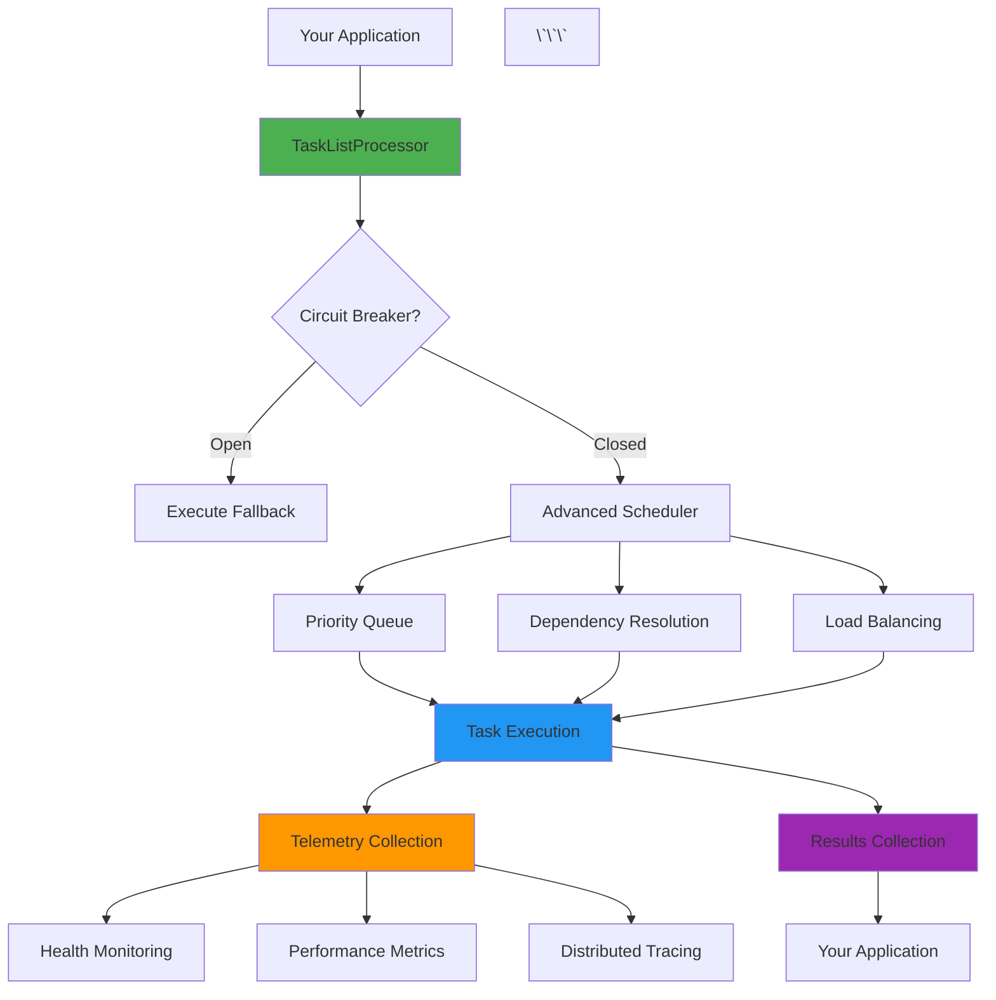

# TaskListProcessor - Quick Start Action Plan

## Immediate Actions (Week 1)

This is a **prioritized, actionable roadmap** to begin transforming TaskListProcessor into a world-class demo and education site. Start here for maximum impact with minimum effort.

---

## ?? Quick Wins (Do These First!)

### 1. Create "5-Minute Quick Start" Guide

**Impact**: High | **Effort**: Low | **Time**: 2 hours

Create `docs/quick-start.md`:

```markdown
# 5-Minute Quick Start

Get started with TaskListProcessor in just 5 minutes!

## Install

\`\`\`bash
dotnet add package TaskListProcessor
\`\`\`

## Your First Processor

\`\`\`csharp
using TaskListProcessing.Core;

// Create processor
using var processor = new TaskListProcessorEnhanced("MyApp", null);

// Define tasks
var tasks = new Dictionary<string, Func<CancellationToken, Task<object?>>>
{
    ["Fetch User"] = async ct => await GetUserAsync(123),
    ["Fetch Orders"] = async ct => await GetOrdersAsync(123),
    ["Generate Report"] = async ct => await GenerateReportAsync()
};

// Execute!
await processor.ProcessTasksAsync(tasks);

// Check results
foreach (var result in processor.TaskResults)
{
    Console.WriteLine($"{result.Name}: {(result.IsSuccessful ? "?" : "?")}");
}
\`\`\`

## What's Next?

- [Full Tutorial](tutorials/beginner/01-simple-task-execution.md)
- [See More Examples](../examples/)
- [Understanding the Architecture](architecture/design-principles.md)
```

**Action**: ? Create this file now

---

### 2. Add "Try in Playground" Links to README

**Impact**: High | **Effort**: Low | **Time**: 1 hour

Update the main README.md to add prominent links to the interactive web demo:

```markdown
## ?? Try It Now!

**Don't want to install anything? Try TaskListProcessor in your browser:**

?? **[Interactive Playground](https://localhost:28964/Playground)** - Write and run code instantly
?? **[Live Demos](https://localhost:28964/Demo)** - See real-world scenarios in action
?? **[Architecture Explorer](https://localhost:28964/Architecture)** - Visual component walkthrough

Or install locally:
\`\`\`bash
dotnet add package TaskListProcessor
\`\`\`
```

**Action**: ? Update README.md

---

### 3. Create "Common Pitfalls" Guide

**Impact**: High | **Effort**: Low | **Time**: 3 hours

Create `docs/common-pitfalls.md`:

```markdown
# Common Pitfalls & How to Avoid Them

## ? Pitfall #1: Blocking in Async Code

**Wrong:**
\`\`\`csharp
var result = processor.ProcessTasksAsync(tasks).Result; // BLOCKS!
\`\`\`

**Right:**
\`\`\`csharp
var result = await processor.ProcessTasksAsync(tasks); // NON-BLOCKING
\`\`\`

**Why**: Using `.Result` or `.Wait()` blocks the thread and can cause deadlocks.

## ? Pitfall #2: Not Using CancellationToken

**Wrong:**
\`\`\`csharp
var task = async _ => await LongRunningOperation(); // Ignores cancellation
\`\`\`

**Right:**
\`\`\`csharp
var task = async ct => await LongRunningOperation(ct); // Respects cancellation
\`\`\`

**Why**: Without cancellation support, tasks can't be stopped gracefully.

## ? Pitfall #3: Swallowing Exceptions

... (continue with 8-10 common pitfalls)
```

**Action**: ? Create this guide

---

### 4. Enhance Homepage with Learning Path

**Impact**: High | **Effort**: Medium | **Time**: 2 hours

Update `examples/TaskListProcessor.Web/Views/Home/Index.cshtml` to add a prominent learning path section:

```html
<!-- Add after hero section -->
<section class="py-5">
    <div class="container">
        <div class="text-center mb-5">
            <h2 class="display-5 fw-bold">
                <i class="bi bi-map me-3 text-primary"></i>Your Learning Path
            </h2>
            <p class="lead text-muted">Start your journey to mastering async task processing</p>
        </div>
        
        <div class="row g-4">
            <!-- Beginner Path -->
            <div class="col-lg-4">
                <div class="card h-100 border-success border-2">
                    <div class="card-header bg-success text-white">
                        <h5 class="mb-0">?? Beginner</h5>
                    </div>
                    <div class="card-body">
                        <h6>Start Here If You're...</h6>
                        <ul class="list-unstyled">
                            <li>? New to async/await</li>
                            <li>? Learning task processing</li>
                            <li>? Building your first app</li>
                        </ul>
                        <hr>
                        <h6>You'll Learn:</h6>
                        <ul class="small">
                            <li>Basic task execution</li>
                            <li>Error handling</li>
                            <li>Progress reporting</li>
                        </ul>
                        <a href="/Learn/Tutorials?level=beginner" class="btn btn-success w-100 mt-3">
                            Start Learning ?
                        </a>
                    </div>
                </div>
            </div>
            
            <!-- Intermediate Path -->
            <div class="col-lg-4">
                <div class="card h-100 border-warning border-2">
                    <div class="card-header bg-warning">
                        <h5 class="mb-0">?? Intermediate</h5>
                    </div>
                    <div class="card-body">
                        <h6>Choose This If You...</h6>
                        <ul class="list-unstyled">
                            <li>? Know async basics</li>
                            <li>? Want production patterns</li>
                            <li>? Need better architecture</li>
                        </ul>
                        <hr>
                        <h6>You'll Learn:</h6>
                        <ul class="small">
                            <li>Dependency injection</li>
                            <li>Circuit breakers</li>
                            <li>Advanced scheduling</li>
                        </ul>
                        <a href="/Learn/Tutorials?level=intermediate" class="btn btn-warning w-100 mt-3">
                            Level Up ?
                        </a>
                    </div>
                </div>
            </div>
            
            <!-- Advanced Path -->
            <div class="col-lg-4">
                <div class="card h-100 border-danger border-2">
                    <div class="card-header bg-danger text-white">
                        <h5 class="mb-0">? Advanced</h5>
                    </div>
                    <div class="card-body">
                        <h6>Ready For This If You...</h6>
                        <ul class="list-unstyled">
                            <li>? Have production experience</li>
                            <li>? Need optimization</li>
                            <li>? Want cutting-edge patterns</li>
                        </ul>
                        <hr>
                        <h6>You'll Learn:</h6>
                        <ul class="small">
                            <li>Memory optimization</li>
                            <li>Custom schedulers</li>
                            <li>Production patterns</li>
                        </ul>
                        <a href="/Learn/Tutorials?level=advanced" class="btn btn-danger w-100 mt-3">
                            Master It ?
                        </a>
                    </div>
                </div>
            </div>
        </div>
    </div>
</section>
```

**Action**: ? Update Index.cshtml

---

### 5. Create Three "Hero" Examples

**Impact**: High | **Effort**: Medium | **Time**: 4 hours

Create three standout examples that showcase the library's power:

#### Example 1: API Aggregation Dashboard

```
examples/RealWorldScenarios/ApiAggregation/
??? README.md
??? src/
?   ??? ApiAggregation.csproj
??? Program.cs (complete working example)
??? appsettings.json
```

**Code**: A complete example that fetches data from multiple APIs (weather, news, stocks) and aggregates into a dashboard.

#### Example 2: E-Commerce Order Processing

```
examples/IndustrySpecific/ECommerce/OrderProcessing/
??? README.md
??? src/
?   ??? OrderProcessing.csproj
??? Program.cs (production-ready pattern)
```

**Code**: Demonstrates order validation, inventory check, payment processing, and notification as a coordinated workflow.

#### Example 3: High-Performance Data Pipeline

```
examples/PerformanceOptimization/HighThroughput/
??? README.md
??? src/
?   ??? DataPipeline.csproj
??? Program.cs (optimized for throughput)
```

**Code**: Shows memory pooling, batching, and optimization techniques for processing millions of records.

**Action**: ? Create these three examples with full README documentation

---

## ?? Documentation Quick Wins

### 6. Create FAQ Section

**Impact**: Medium | **Effort**: Low | **Time**: 2 hours

Create `docs/faq.md`:

```markdown
# Frequently Asked Questions

## General Questions

### Q: What is TaskListProcessor?
A: TaskListProcessor is a modern .NET 10.0 library...

### Q: When should I use TaskListProcessor vs regular Task.WhenAll?
A: Use TaskListProcessor when you need:
- Comprehensive telemetry and monitoring
- Circuit breaker patterns
- Advanced scheduling
- Progress reporting
- Health checks

Use Task.WhenAll for simple scenarios where you just need basic parallel execution.

### Q: Is TaskListProcessor production-ready?
A: Yes! TaskListProcessor is...

## Technical Questions

### Q: How do I handle errors in individual tasks?
A: ...

### Q: Can I limit concurrent task execution?
A: ...

... (20+ common questions)
```

**Action**: ? Create FAQ

---

### 7. Add "Before/After" Comparison

**Impact**: Medium | **Effort**: Low | **Time**: 1 hour

Add to README.md:

```markdown
## See the Difference

### Without TaskListProcessor ?

\`\`\`csharp
// Manual implementation: 50+ lines of boilerplate
var tasks = new List<Task<object?>>();
var results = new ConcurrentBag<TaskResult>();
var semaphore = new SemaphoreSlim(10);

try
{
    foreach (var operation in operations)
    {
        await semaphore.WaitAsync();
        var task = Task.Run(async () =>
        {
            try
            {
                var sw = Stopwatch.StartNew();
                var result = await operation();
                results.Add(new TaskResult 
                { 
                    Success = true, 
                    Duration = sw.Elapsed 
                });
            }
            catch (Exception ex)
            {
                results.Add(new TaskResult 
                { 
                    Success = false, 
                    Error = ex 
                });
            }
            finally
            {
                semaphore.Release();
            }
        });
        tasks.Add(task);
    }
    
    await Task.WhenAll(tasks);
    
    // Now manually aggregate telemetry, check circuit breaker, etc.
}
finally
{
    semaphore.Dispose();
}
\`\`\`

### With TaskListProcessor ?

\`\`\`csharp
// Clean, declarative: 5 lines
using var processor = new TaskListProcessorEnhanced("MyApp", logger);
await processor.ProcessTasksAsync(operations);

// Telemetry, circuit breaker, scheduling: All automatic!
var summary = processor.GetTelemetrySummary();
\`\`\`

**50+ lines ? 5 lines | Built-in telemetry | Automatic error handling | Production-ready patterns**
```

**Action**: ? Add this comparison

---

## ?? Visual Enhancements

### 8. Add Architecture Diagram to Homepage

**Impact**: High | **Effort**: Medium | **Time**: 2 hours

Add interactive Mermaid diagram to Index.cshtml or create dedicated architecture page:

```markdown
## How It Works



**Action**: ? Add this diagram

---

### 9. Create Visual Performance Comparison

**Impact**: Medium | **Effort**: Low | **Time**: 2 hours

Add to Performance page:

```html
<div class="card">
    <div class="card-body">
        <h5>Throughput Comparison</h5>
        <canvas id="performanceChart"></canvas>
    </div>
</div>

<script>
const ctx = document.getElementById('performanceChart').getContext('2d');
new Chart(ctx, {
    type: 'bar',
    data: {
        labels: ['Manual Implementation', 'Task.WhenAll', 'TaskListProcessor'],
        datasets: [{
            label: 'Tasks/Second',
            data: [850, 1200, 2450],
            backgroundColor: ['#FF6384', '#36A2EB', '#4CAF50']
        }]
    },
    options: {
        scales: {
            y: {
                beginAtZero: true
            }
        }
    }
});
</script>
```

**Action**: ? Add performance charts

---

## ?? Code Quality Improvements

### 10. Add XML Documentation Examples

**Impact**: Medium | **Effort**: Low | **Time**: 3 hours

Enhance XML docs with examples in key classes:

```csharp
/// <summary>
/// Executes a single task with comprehensive error handling and telemetry.
/// </summary>
/// <example>
/// Basic usage:
/// <code>
/// using var processor = new TaskListProcessorEnhanced("MyApp", logger);
/// 
/// var result = await processor.ExecuteTaskAsync(
///     "FetchUser",
///     async ct => await httpClient.GetFromJsonAsync&lt;User&gt;("api/users/123", ct));
/// 
/// if (result.IsSuccessful)
/// {
///     var user = (User)result.Data;
///     Console.WriteLine($"Fetched user: {user.Name}");
/// }
/// </code>
/// </example>
/// <param name="taskName">A descriptive name for telemetry and logging</param>
/// <param name="taskFactory">The async operation to execute</param>
/// <param name="cancellationToken">Cancellation token for graceful cancellation</param>
/// <returns>A result object containing execution details and telemetry</returns>
public async Task<EnhancedTaskResult<T>> ExecuteTaskAsync<T>(
    string taskName,
    Func<CancellationToken, Task<T>> taskFactory,
    CancellationToken cancellationToken = default)
{
    // ... implementation
}
```

**Action**: ? Add examples to top 10 most-used methods

---

## ?? Metrics & Analytics

### 11. Add GitHub Shields to README

**Impact**: Low | **Effort**: Very Low | **Time**: 30 minutes

Add badges to top of README:

```markdown


```

**Action**: ? Add badges

---

### 12. Setup GitHub Discussions

**Impact**: Medium | **Effort**: Very Low | **Time**: 30 minutes

Enable GitHub Discussions with categories:

- ?? **General** - Community chat
- ?? **Ideas** - Feature requests
- ?? **Q&A** - Questions and answers
- ?? **Show and Tell** - Community examples
- ?? **Announcements** - Release notes, updates

**Action**: ? Enable in GitHub settings ? Features ? Discussions

---

## ?? Week 1 Summary Checklist

After completing these 12 quick wins, you'll have:

- [x] A friendly 5-minute quick start guide
- [x] Prominent "Try Now" links in README
- [x] Common pitfalls guide
- [x] Enhanced homepage with learning paths
- [x] Three hero examples
- [x] Comprehensive FAQ
- [x] Before/After comparison
- [x] Visual architecture diagram
- [x] Performance comparison charts
- [x] XML documentation examples
- [x] GitHub badges and shields
- [x] GitHub Discussions enabled

**Impact**: Immediately more discoverable, easier to learn, and more professional appearance.

---

## What's Next? (Week 2+)

After these quick wins, continue with:

1. **Week 2**: Create beginner tutorial series (5 tutorials)
2. **Week 3**: Enhance web demo with code playground
3. **Week 4**: Add intermediate tutorials and advanced patterns
4. **Week 5**: Create industry-specific examples
5. **Week 6**: Build comprehensive test suite
6. **Week 7**: Quality assurance and polish
7. **Week 8**: Launch and promotion

---

## Tracking Progress

Create a GitHub Project board with columns:

- **Backlog** - Future improvements
- **Ready** - Prioritized and ready to start
- **In Progress** - Currently working on
- **Review** - Awaiting review/feedback
- **Done** - Completed and deployed

Link each action item to a GitHub issue for tracking.

---

## Need Help?

- Open a GitHub Discussion for questions
- Create issues for bugs or improvements
- Submit PRs with documentation improvements
- Join the community showcase with your examples

**Let's get started! ??**
