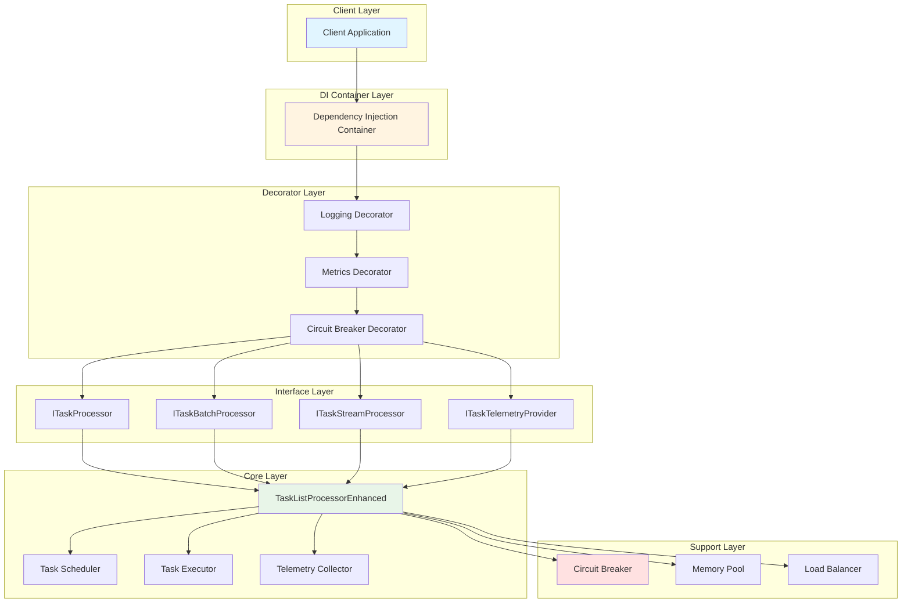
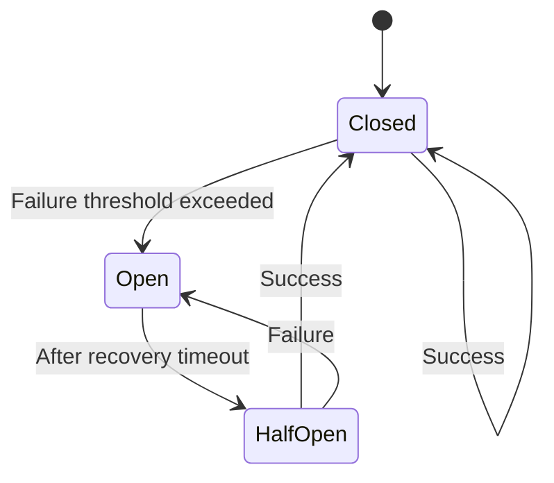
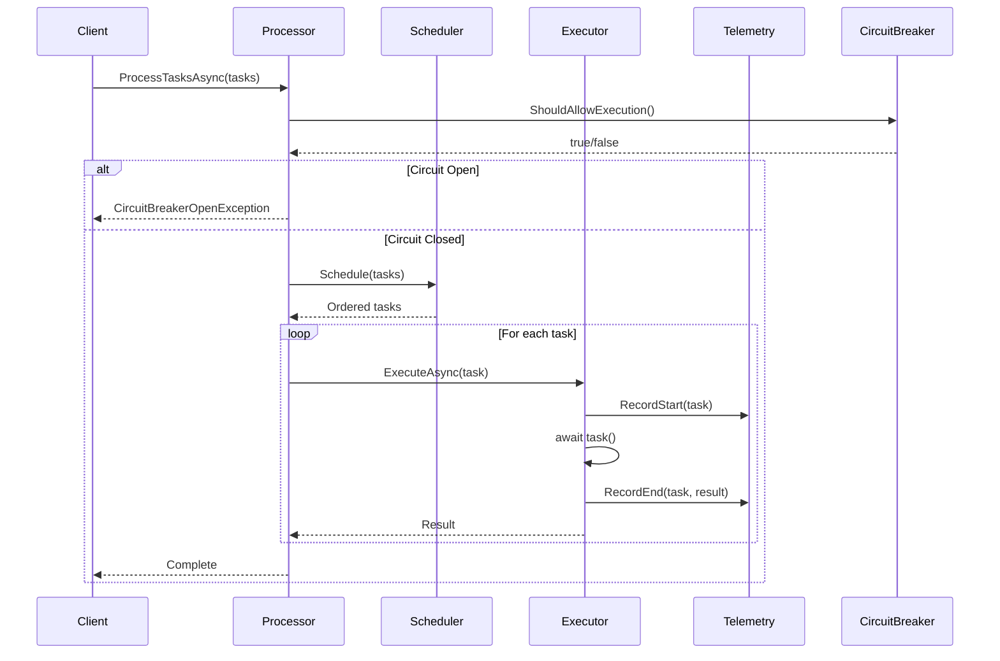
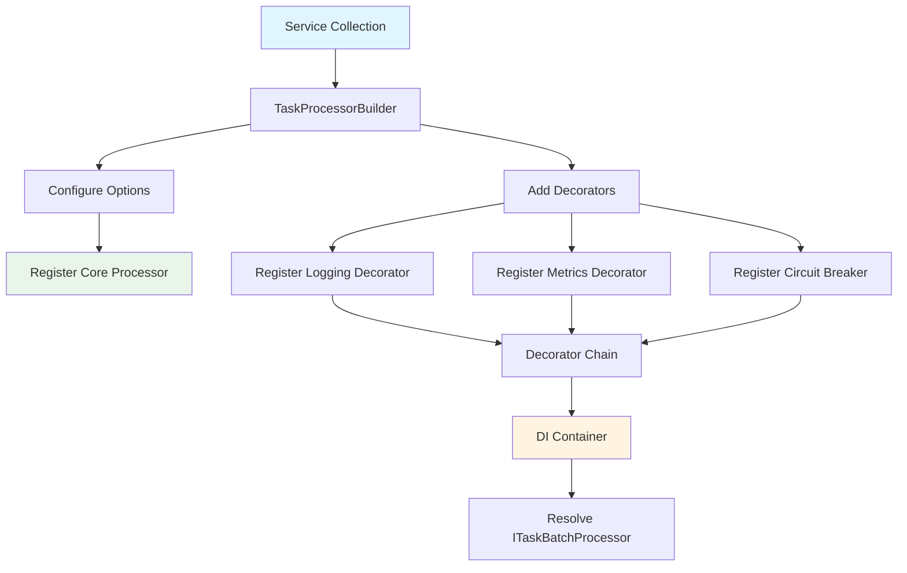
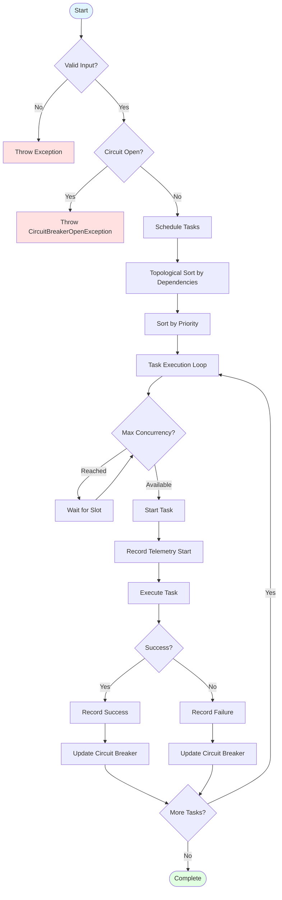

# Design Principles & Architecture

This document explains the core design principles and architectural patterns that make TaskListProcessor robust, maintainable, and extensible.

---

## Table of Contents

- [Architectural Overview](#architectural-overview)
- [SOLID Principles](#solid-principles)
- [Design Patterns](#design-patterns)
- [Architecture Diagrams](#architecture-diagrams)
- [Component Responsibilities](#component-responsibilities)
- [Data Flow](#data-flow)
- [Extension Points](#extension-points)

---

## Architectural Overview

TaskListProcessor is built on a layered architecture that emphasizes:
- **Separation of Concerns**: Clear boundaries between components
- **Interface Segregation**: Focused, purpose-specific interfaces
- **Dependency Injection**: Loose coupling and testability
- **Decorator Pattern**: Pluggable cross-cutting concerns
- **Async-First**: Native asynchronous operation throughout

### High-Level Architecture



---

## SOLID Principles

TaskListProcessor exemplifies all five SOLID principles:

### S - Single Responsibility Principle

**Each class has one reason to change.**

```csharp
// ✅ Each class has a single, well-defined responsibility

public class TaskProcessor : ITaskProcessor
{
    // Responsibility: Execute single tasks
    public async Task<EnhancedTaskResult<T>> ExecuteTaskAsync<T>(...) { }
}

public class TaskBatchProcessor : ITaskBatchProcessor
{
    // Responsibility: Execute task batches
    public async Task ProcessTasksAsync(...) { }
}

public class TaskTelemetryProvider : ITaskTelemetryProvider
{
    // Responsibility: Collect and report telemetry
    public TelemetrySummary GetTelemetrySummary() { }
}

public class CircuitBreaker
{
    // Responsibility: Manage circuit breaker state
    public bool ShouldAllowExecution() { }
}
```

**Benefits**:
- Easy to understand
- Easy to test
- Easy to modify
- Clear purpose

### O - Open/Closed Principle

**Open for extension, closed for modification.**

The decorator pattern allows extending behavior without modifying core classes:

```csharp
// ✅ Extend behavior through decorators
public class LoggingTaskProcessorDecorator : ITaskBatchProcessor
{
    private readonly ITaskBatchProcessor _inner;
    private readonly ILogger _logger;

    public LoggingTaskProcessorDecorator(
        ITaskBatchProcessor inner,
        ILogger logger)
    {
        _inner = inner;
        _logger = logger;
    }

    public async Task ProcessTasksAsync(...)
    {
        _logger.LogInformation("Starting batch processing");
        await _inner.ProcessTasksAsync(...);
        _logger.LogInformation("Completed batch processing");
    }
}

// Add new decorators without modifying existing code
public class MetricsDecorator : ITaskBatchProcessor { }
public class CachingDecorator : ITaskBatchProcessor { }
public class RetryDecorator : ITaskBatchProcessor { }
```

**Benefits**:
- Add features without risk
- Compose behaviors
- Maintain backward compatibility

### L - Liskov Substitution Principle

**Subtypes must be substitutable for their base types.**

All implementations fully satisfy their interface contracts:

```csharp
// ✅ Any ITaskBatchProcessor can be used interchangeably
ITaskBatchProcessor processor1 = new TaskBatchProcessor("Batch", logger);
ITaskBatchProcessor processor2 = new TaskListProcessorEnhanced("Enhanced", logger);
ITaskBatchProcessor processor3 = new LoggingTaskProcessorDecorator(processor1, logger);

// All work identically from client's perspective
await processor1.ProcessTasksAsync(tasks);
await processor2.ProcessTasksAsync(tasks);
await processor3.ProcessTasksAsync(tasks);
```

**Benefits**:
- Predictable behavior
- Safe polymorphism
- Easy mocking/testing

### I - Interface Segregation Principle

**Clients shouldn't depend on interfaces they don't use.**

TaskListProcessor provides focused, purpose-specific interfaces:

```csharp
// ✅ Segregated interfaces for different needs

public interface ITaskProcessor
{
    // For single task execution only
    Task<EnhancedTaskResult<T>> ExecuteTaskAsync<T>(...);
}

public interface ITaskBatchProcessor
{
    // For batch processing only
    Task ProcessTasksAsync(...);
    Task ProcessTaskDefinitionsAsync(...);
}

public interface ITaskStreamProcessor
{
    // For streaming results only
    IAsyncEnumerable<EnhancedTaskResult<object>> ProcessTasksStreamAsync(...);
}

public interface ITaskTelemetryProvider
{
    // For telemetry only
    TelemetrySummary GetTelemetrySummary();
    HealthCheckResult PerformHealthCheck();
}

// Clients can depend on exactly what they need
public class SingleTaskService
{
    private readonly ITaskProcessor _processor;  // Only needs single execution
}

public class BatchService
{
    private readonly ITaskBatchProcessor _processor;  // Only needs batch processing
}

public class MonitoringService
{
    private readonly ITaskTelemetryProvider _telemetry;  // Only needs telemetry
}
```

**Benefits**:
- Minimal dependencies
- Clear contracts
- Easier testing
- Better encapsulation

### D - Dependency Inversion Principle

**Depend on abstractions, not concretions.**

High-level modules depend on interfaces, not concrete implementations:

```csharp
// ✅ Depend on abstractions
public class DataAggregationService
{
    private readonly ITaskBatchProcessor _processor;  // Interface, not concrete class
    private readonly ILogger _logger;

    public DataAggregationService(
        ITaskBatchProcessor processor,  // Injected dependency
        ILogger logger)
    {
        _processor = processor;
        _logger = logger;
    }

    public async Task AggregateDataAsync()
    {
        var tasks = CreateTasks();
        await _processor.ProcessTasksAsync(tasks);  // Works with any implementation
    }
}

// DI Configuration
services.AddTaskListProcessor()
    .WithLogging()
    .WithMetrics();  // Implementation resolved at runtime
```

**Benefits**:
- Loose coupling
- Easy testing with mocks
- Flexibility to change implementations
- Dependency injection friendly

---

## Design Patterns

### 1. Decorator Pattern

**Purpose**: Add cross-cutting concerns without modifying core logic.


**Implementation**:
```csharp
public class LoggingDecorator : ITaskBatchProcessor
{
    private readonly ITaskBatchProcessor _inner;

    public async Task ProcessTasksAsync(...)
    {
        Log("Starting");
        await _inner.ProcessTasksAsync(...);
        Log("Completed");
    }
}
```

**Benefits**:
- Add logging, metrics, caching, retry, etc.
- Composable behaviors
- No core code changes

### 2. Factory Pattern

**Purpose**: Create task instances with consistent configuration.

```csharp
public class TaskFactory
{
    public Func<CancellationToken, Task<object?>> CreateWeatherTask(string city)
    {
        return async ct =>
        {
            var service = new WeatherService();
            return await service.GetWeatherAsync(city, ct);
        };
    }
}
```

### 3. Strategy Pattern

**Purpose**: Pluggable scheduling strategies.

```csharp
public interface ITaskSchedulingStrategy
{
    IEnumerable<TaskDefinition> ScheduleTasks(IEnumerable<TaskDefinition> tasks);
}

public class PrioritySchedulingStrategy : ITaskSchedulingStrategy { }
public class FIFOSchedulingStrategy : ITaskSchedulingStrategy { }
public class LIFOSchedulingStrategy : ITaskSchedulingStrategy { }
```

### 4. Circuit Breaker Pattern

**Purpose**: Prevent cascading failures.



**States**:
- **Closed**: Normal operation
- **Open**: Blocking calls (too many failures)
- **Half-Open**: Testing recovery

### 5. Observer Pattern

**Purpose**: Progress reporting.

```csharp
public interface IProgress<T>
{
    void Report(T value);
}

var progress = new Progress<TaskProgress>(p =>
{
    Console.WriteLine($"{p.CompletedTasks}/{p.TotalTasks}");
});

await processor.ProcessTasksAsync(tasks, progress);
```

---

## Architecture Diagrams

### Component Interaction



### Dependency Injection Flow



### Task Execution Flow



---

## Component Responsibilities

### Core Components

| Component | Responsibility | Key Methods |
|-----------|----------------|-------------|
| **TaskListProcessorEnhanced** | Main orchestrator | `ProcessTasksAsync()` |
| **TaskProcessor** | Single task execution | `ExecuteTaskAsync<T>()` |
| **TaskBatchProcessor** | Batch processing | `ProcessTasksAsync()` |
| **TaskStreamProcessor** | Streaming results | `ProcessTasksStreamAsync()` |
| **TaskTelemetryProvider** | Telemetry collection | `GetTelemetrySummary()` |

### Supporting Components

| Component | Responsibility | Key Methods |
|-----------|----------------|-------------|
| **CircuitBreaker** | Failure protection | `ShouldAllowExecution()` |
| **AdvancedTaskScheduler** | Task scheduling | `Schedule()` |
| **TopologicalDependencyResolver** | Dependency resolution | `ResolveDependencies()` |
| **LoadBalancingTaskDistributor** | Load distribution | `DistributeTasks()` |

### Data Models

| Model | Purpose | Key Properties |
|-------|---------|----------------|
| **EnhancedTaskResult<T>** | Task result | `Data`, `IsSuccessful`, `ErrorMessage` |
| **TaskDefinition** | Task metadata | `Name`, `Factory`, `Dependencies`, `Priority` |
| **TaskProgress** | Progress info | `CompletedTasks`, `TotalTasks`, `PercentComplete` |
| **TaskTelemetry** | Telemetry data | `TaskName`, `DurationMs`, `IsSuccessful` |
| **CircuitBreakerStats** | Circuit state | `State`, `FailureCount`, `OpenedAt` |

---

## Data Flow

### 1. Task Submission Flow

```
Client Code
    ↓
Dictionary<string, Func<CT, Task<object?>>>
    ↓
TaskListProcessor.ProcessTasksAsync()
    ↓
Validation & Circuit Breaker Check
    ↓
Task Scheduling (Dependencies + Priority)
    ↓
Concurrent Execution (Bounded by MaxConcurrent)
    ↓
Result Collection
    ↓
Telemetry Aggregation
    ↓
Return to Client
```

### 2. Telemetry Data Flow

```
Task Execution Start
    ↓
Record Start Time
    ↓
Execute Task
    ↓
Record End Time
    ↓
Calculate Duration
    ↓
Categorize Result (Success/Failure)
    ↓
Store in Telemetry Collection
    ↓
Update Circuit Breaker Stats
    ↓
Available via GetTelemetrySummary()
```

### 3. Error Handling Flow

```
Exception Thrown in Task
    ↓
Catch in Executor
    ↓
Categorize Error
    ↓
Create Failed Result
    ↓
Log Error (if logger present)
    ↓
Update Circuit Breaker
    ↓
Continue Other Tasks (Isolation)
    ↓
Include in Results Collection
```

---

## Extension Points

TaskListProcessor is designed to be extended at multiple points:

### 1. Custom Decorators

Add custom cross-cutting concerns:

```csharp
public class CustomDecorator : ITaskBatchProcessor
{
    private readonly ITaskBatchProcessor _inner;

    public async Task ProcessTasksAsync(...)
    {
        // Before
        CustomBehavior();

        await _inner.ProcessTasksAsync(...);

        // After
        CustomCleanup();
    }
}

// Register
services.AddTaskListProcessor()
    .WithCustomDecorator<CustomDecorator>();
```

### 2. Custom Scheduling Strategies

Implement custom task ordering:

```csharp
public class CustomSchedulingStrategy : ITaskSchedulingStrategy
{
    public IEnumerable<TaskDefinition> ScheduleTasks(
        IEnumerable<TaskDefinition> tasks)
    {
        // Custom scheduling logic
        return tasks.OrderBy(YourCustomLogic);
    }
}

var options = new TaskListProcessorOptions
{
    SchedulingStrategy = new CustomSchedulingStrategy()
};
```

### 3. Custom Telemetry Exporters

Export telemetry to custom sinks:

```csharp
public interface ITelemetryExporter
{
    Task ExportAsync(IEnumerable<TaskTelemetry> telemetry);
}

public class CustomExporter : ITelemetryExporter
{
    public async Task ExportAsync(IEnumerable<TaskTelemetry> telemetry)
    {
        // Export to your monitoring system
    }
}
```

### 4. Custom Error Categorization

Implement domain-specific error categories:

```csharp
public class CustomErrorCategorizer : IErrorCategorizer
{
    public ErrorCategory Categorize(Exception ex)
    {
        return ex switch
        {
            MyCustomException => ErrorCategory.Custom,
            _ => ErrorCategory.Unknown
        };
    }
}
```

---

## Summary

TaskListProcessor's architecture is built on:

✅ **SOLID Principles** - All five principles rigorously applied
✅ **Design Patterns** - Decorator, Factory, Strategy, Circuit Breaker, Observer
✅ **Clear Separation** - Layered architecture with defined responsibilities
✅ **Extensibility** - Multiple extension points for customization
✅ **Testability** - Interface-based design for easy mocking
✅ **Async-First** - Native async/await throughout

This architecture provides:
- **Maintainability**: Easy to understand and modify
- **Scalability**: Efficient concurrent execution
- **Reliability**: Circuit breakers and error isolation
- **Observability**: Comprehensive telemetry
- **Flexibility**: Extensible through decorators and strategies

---

## Related Documentation

- [Architectural Decisions (ADRs)](architectural-decisions.md)
- [Design Patterns Explained](patterns-explained.md)
- [Performance Considerations](performance-considerations.md)
- [API Reference](../api-reference/)

---

*Built with ❤️ by [Mark Hazleton](https://markhazleton.com)*
