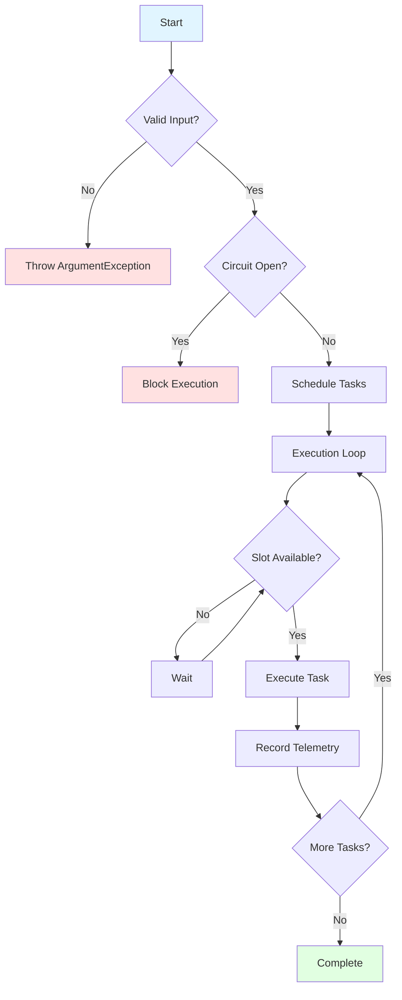

# TaskListProcessor Fundamentals

This guide explains the core concepts, architecture, and principles behind TaskListProcessor. After reading this, you'll understand **why** things work the way they do, not just **how** to use them.

---

## Table of Contents

- [Why TaskListProcessor Exists](#why-tasklistprocessor-exists)
- [Core Concepts](#core-concepts)
- [How It Works](#how-it-works)
- [Key Components](#key-components)
- [Task Lifecycle](#task-lifecycle)
- [Error Handling Philosophy](#error-handling-philosophy)
- [Concurrency Model](#concurrency-model)
- [Telemetry & Observability](#telemetry--observability)
- [Design Principles](#design-principles)

---

## Why TaskListProcessor Exists

### The Problem

Modern applications frequently need to coordinate multiple asynchronous operations:

```csharp
// Typical scenario: Aggregate data from multiple sources
var weatherTask = GetWeatherAsync(city);
var hotelsTask = GetHotelsAsync(city);
var activitiesTask = GetActivitiesAsync(city);
var restaurantsTask = GetRestaurantsAsync(city);

// Wait for all
await Task.WhenAll(weatherTask, hotelsTask, activitiesTask, restaurantsTask);
```

**Challenges with this approach:**
- ❌ No error isolation (one failure crashes all)
- ❌ No telemetry (how long did each take?)
- ❌ No progress reporting
- ❌ No cancellation coordination
- ❌ No retry or circuit breaker
- ❌ Manual error handling for each task
- ❌ Difficult to test and maintain

### The Solution

TaskListProcessor provides a **robust, production-ready framework** that handles all of this automatically:

```csharp
var tasks = new Dictionary<string, Func<CancellationToken, Task<object?>>>
{
    ["Weather"] = async ct => await GetWeatherAsync(city, ct),
    ["Hotels"] = async ct => await GetHotelsAsync(city, ct),
    ["Activities"] = async ct => await GetActivitiesAsync(city, ct),
    ["Restaurants"] = async ct => await GetRestaurantsAsync(city, ct)
};

await processor.ProcessTasksAsync(tasks);
```

**Benefits:**
- ✅ Automatic error isolation
- ✅ Built-in telemetry
- ✅ Progress reporting
- ✅ Cancellation coordination
- ✅ Circuit breaker support
- ✅ Comprehensive error handling
- ✅ Easy to test

---

## Core Concepts

### 1. Task Factories

Tasks are defined as **factories** (functions that create tasks), not tasks themselves:

```csharp
// ✅ Correct: Factory pattern
Func<CancellationToken, Task<object?>> factory = async ct =>
{
    return await SomeOperationAsync(ct);
};

// ❌ Wrong: Creating task immediately
Task<object?> task = SomeOperationAsync(cancellationToken);
```

**Why factories?**
- Tasks can be created at the right time
- Proper cancellation token binding
- Enables retries and circuit breaker
- Better resource management

### 2. Task Names

Every task has a **unique name** for identification:

```csharp
var tasks = new Dictionary<string, Func<CancellationToken, Task<object?>>>
{
    ["Descriptive Name"] = taskFactory
    //  ↑
    // Used in telemetry, logging, and results
};
```

**Naming conventions:**
- Be descriptive: `"Fetch User Profile"` not `"Task1"`
- Use consistent format: `"City Weather"`, `"City Hotels"`
- Include context when needed: `"London Weather"`

### 3. Results

Every task produces an `EnhancedTaskResult`:

```csharp
public class EnhancedTaskResult<T>
{
    public string Name { get; set; }           // Task name
    public T? Data { get; set; }               // Result data (if successful)
    public bool IsSuccessful { get; set; }     // Success/failure
    public string? ErrorMessage { get; set; }  // Error (if failed)
    public ErrorCategory ErrorCategory { get; set; }  // Error type
    public TimeSpan ExecutionTime { get; set; }      // How long it took
}
```

**Always check success before using data:**
```csharp
if (result.IsSuccessful)
{
    var data = result.Data;  // Safe to use
}
else
{
    logger.LogError(result.ErrorMessage);
}
```

### 4. Error Isolation

**Critical concept:** Task failures are isolated. One failed task doesn't affect others.

```csharp
var tasks = new Dictionary<string, Func<CancellationToken, Task<object?>>>
{
    ["Success 1"] = async ct => "OK",
    ["Failure"] = async ct => throw new Exception("Boom!"),
    ["Success 2"] = async ct => "Also OK"
};

await processor.ProcessTasksAsync(tasks);

// All three complete:
// Success 1: ✅ "OK"
// Failure:   ❌ Exception captured
// Success 2: ✅ "Also OK"
```

**Benefits:**
- Partial success is possible
- System remains resilient
- Easy to identify and handle failures

---

## How It Works

### High-Level Flow

```
1. Define Tasks (as factories)
         ↓
2. Submit to Processor
         ↓
3. Processor validates & schedules
         ↓
4. Concurrent execution (bounded by MaxConcurrent)
         ↓
5. Error handling & telemetry collection
         ↓
6. Results aggregation
         ↓
7. Return to caller
```

### Execution Model



### Concurrency Control

TaskListProcessor limits concurrent execution:

```csharp
var options = new TaskListProcessorOptions
{
    MaxConcurrentTasks = 10  // Max 10 tasks at once
};
```

**Example with 100 tasks, max 10 concurrent:**
```
Time →

0ms:  [T1][T2][T3][T4][T5][T6][T7][T8][T9][T10]
100ms:[T11][T12][T13][T14][T15][T16][T17][T18][T19][T20]
200ms:[T21][T22][T23]... and so on
```

**Why limit concurrency?**
- Prevents resource exhaustion
- Respects external API rate limits
- Controls memory usage
- Maintains system stability

---

## Key Components

### 1. TaskListProcessorEnhanced

The main orchestrator:

```csharp
using var processor = new TaskListProcessorEnhanced(
    name: "MyProcessor",      // Processor name (for logging)
    logger: logger,            // ILogger (optional)
    options: options           // Configuration (optional)
);
```

**Responsibilities:**
- Task scheduling and execution
- Error handling and isolation
- Telemetry collection
- Progress reporting
- Circuit breaker management

### 2. TaskDefinition

For tasks with dependencies and priorities:

```csharp
var definition = new TaskDefinition
{
    Name = "Task Name",
    Factory = async ct => await DoWorkAsync(ct),
    Dependencies = new[] { "OtherTask" },  // Runs after OtherTask
    Priority = TaskPriority.High           // Higher priority = runs first
};
```

**Use cases:**
- Tasks that depend on other tasks
- Priority-based execution
- Complex workflows

### 3. Interfaces

Clean, focused interfaces:

```csharp
ITaskProcessor           // Single task execution
ITaskBatchProcessor      // Batch processing
ITaskStreamProcessor     // Streaming results
ITaskTelemetryProvider   // Telemetry access
```

**Use with dependency injection:**
```csharp
public class MyService
{
    private readonly ITaskBatchProcessor _processor;

    public MyService(ITaskBatchProcessor processor)
    {
        _processor = processor;
    }
}
```

---

## Task Lifecycle

### 1. Creation Phase

```csharp
// Task factory is defined but NOT executed
var factory = async ct => await DoWorkAsync(ct);
```

### 2. Scheduling Phase

```csharp
await processor.ProcessTasksAsync(tasks);
// ↑ Processor receives factories
```

**Processor actions:**
- Validates input
- Checks circuit breaker
- Sorts by dependencies (if any)
- Sorts by priority (if specified)

### 3. Execution Phase

**For each task:**
```
1. Wait for available concurrency slot
2. Create task from factory (with cancellation token)
3. Record start time
4. Execute task
5. Catch any exceptions
6. Record end time and result
7. Update telemetry
8. Update circuit breaker
9. Release concurrency slot
```

### 4. Completion Phase

```csharp
// All tasks complete (or cancelled)
// Results available in processor.TaskResults
foreach (var result in processor.TaskResults)
{
    // Process result
}
```

---

## Error Handling Philosophy

### Automatic Error Handling

TaskListProcessor handles errors **automatically**:

```csharp
var tasks = new Dictionary<string, Func<CancellationToken, Task<object?>>>
{
    ["MayFail"] = async ct =>
    {
        // No try/catch needed!
        return await RiskyOperationAsync(ct);
    }
};
```

**What happens on error:**
1. Exception is caught
2. Error is categorized (Network, Timeout, Validation, etc.)
3. Result marked as failed
4. Error message stored
5. Telemetry updated
6. Circuit breaker updated
7. Other tasks continue

### Error Categories

Errors are automatically categorized:

```csharp
public enum ErrorCategory
{
    None,           // No error
    Network,        // Network/connectivity issues
    Timeout,        // Operation timed out
    Validation,     // Invalid input/data
    Authorization,  // Permission denied
    NotFound,       // Resource not found
    Server,         // Server error (5xx)
    Client,         // Client error (4xx)
    Unknown         // Uncategorized error
}
```

**Use categories for smart error handling:**
```csharp
foreach (var result in processor.TaskResults.Where(r => !r.IsSuccessful))
{
    switch (result.ErrorCategory)
    {
        case ErrorCategory.Timeout:
            // Retry with longer timeout
            break;
        case ErrorCategory.Network:
            // Check connectivity, queue for retry
            break;
        case ErrorCategory.Validation:
            // Fix input data
            break;
    }
}
```

### Error Isolation

**Key principle:** Errors don't propagate.

```csharp
// All tasks complete independently
Task A: Success  ✅
Task B: Failure  ❌  (doesn't affect C or D)
Task C: Success  ✅
Task D: Success  ✅
```

**Exception:** Cancellation affects all tasks:
```csharp
using var cts = new CancellationTokenSource();
cts.CancelAfter(TimeSpan.FromSeconds(5));

await processor.ProcessTasksAsync(tasks, cancellationToken: cts.Token);
// All tasks cancelled after 5 seconds
```

---

## Concurrency Model

### Thread Pool Usage

TaskListProcessor uses the .NET thread pool efficiently:

```csharp
// ✅ I/O-bound tasks (most common)
["API Call"] = async ct => await httpClient.GetStringAsync(url, ct);
// Uses async I/O, doesn't block threads

// ✅ CPU-bound tasks (use Task.Run)
["Heavy Compute"] = async ct => await Task.Run(() => Compute(), ct);
// Offloaded to thread pool
```

### Concurrency Limits

**Default:** `Environment.ProcessorCount * 2`

```csharp
// 8-core CPU → Default: 16 concurrent tasks
```

**Custom limits:**
```csharp
var options = new TaskListProcessorOptions
{
    MaxConcurrentTasks = 5  // Limit to 5 concurrent
};
```

**When to limit:**
- External API rate limits (e.g., 10 req/sec)
- Database connection pool limits (e.g., max 100 connections)
- Memory constraints
- Controlled resource usage

### Execution Order

**Without dependencies:** Concurrent execution (unordered)

```csharp
// All start simultaneously (up to MaxConcurrent limit)
Task A ━━━━━━━━┓
Task B ━━━┓    ┃
Task C ━━━━━━┓┃
            ┗┻┛ All complete
```

**With dependencies:** Topological order

```csharp
var definitions = new[]
{
    new TaskDefinition { Name = "A", ... },
    new TaskDefinition { Name = "B", Dependencies = new[] { "A" }, ... },
    new TaskDefinition { Name = "C", Dependencies = new[] { "A" }, ... },
    new TaskDefinition { Name = "D", Dependencies = new[] { "B", "C" }, ... }
};

// Execution:
A ━━━━┓
      ┣━ B ━━━┓
      ┗━ C ━━━┫━ D
              ┛
```

---

## Telemetry & Observability

### Automatic Telemetry Collection

Every task execution is measured:

```csharp
public class TaskTelemetry
{
    public string TaskName { get; set; }
    public DateTime StartTime { get; set; }
    public DateTime EndTime { get; set; }
    public double DurationMs { get; set; }
    public bool IsSuccessful { get; set; }
}
```

### Access Telemetry

```csharp
await processor.ProcessTasksAsync(tasks);

// Individual telemetry
foreach (var telemetry in processor.Telemetry)
{
    Console.WriteLine($"{telemetry.TaskName}: {telemetry.DurationMs}ms");
}

// Aggregated summary
var summary = processor.GetTelemetrySummary();
Console.WriteLine($"Success Rate: {summary.SuccessRate:F1}%");
Console.WriteLine($"Average Time: {summary.AverageExecutionTime:F0}ms");
```

### Telemetry Use Cases

- **Performance monitoring**: Identify slow tasks
- **Error tracking**: Calculate failure rates
- **Capacity planning**: Understand load patterns
- **SLA compliance**: Verify response times
- **Debugging**: Diagnose issues

---

## Design Principles

### 1. Fail-Safe

**Principle:** Failures should be isolated and recoverable.

- Tasks fail independently
- System remains operational
- Partial success is acceptable

### 2. Observable

**Principle:** Everything should be measurable.

- Automatic telemetry collection
- Comprehensive logging
- Health checks available

### 3. Async-First

**Principle:** Native asynchronous operation.

- All operations are async
- Proper cancellation support
- Non-blocking execution

### 4. Composable

**Principle:** Build complex behavior from simple pieces.

- Decorator pattern for cross-cutting concerns
- Interface segregation for focused contracts
- Dependency injection for loose coupling

### 5. Production-Ready

**Principle:** Ready for real-world use.

- Circuit breaker for resilience
- Memory optimization
- Load balancing
- Comprehensive error handling

---

## Key Takeaways

### ✅ What You Should Know

1. **Task Factories**: Tasks are defined as factories, not created immediately
2. **Error Isolation**: One task failure doesn't affect others
3. **Automatic Telemetry**: Every execution is measured and logged
4. **Concurrency Control**: Bounded concurrent execution prevents resource exhaustion
5. **Result Checking**: Always check `IsSuccessful` before using `Data`
6. **Cancellation**: Use cancellation tokens for timeouts and user cancellation
7. **Error Categories**: Errors are automatically categorized for smart handling

### ✅ Best Practices

1. **Use factories**: Define tasks as `Func<CancellationToken, Task<object?>>`
2. **Name descriptively**: Use clear, meaningful task names
3. **Check results**: Always validate `IsSuccessful` before using data
4. **Use cancellation**: Pass cancellation tokens through your operations
5. **Set limits**: Configure appropriate `MaxConcurrentTasks`
6. **Log**: Provide an `ILogger` for diagnostic information
7. **Dispose**: Use `using` statements for proper cleanup

---

## Next Steps

Now that you understand the fundamentals:

1. **Practice**: Build [Your First Real Processor](03-your-first-processor.md)
2. **Learn Patterns**: Review [Common Pitfalls](04-common-pitfalls.md)
3. **Explore**: Try [Beginner Tutorials](../tutorials/beginner/)
4. **Deep Dive**: Read [Architecture Documentation](../architecture/design-principles.md)

---

**Questions?** Check the [FAQ](../troubleshooting/faq.md) or [ask in Discussions](https://github.com/markhazleton/TaskListProcessor/discussions)!

---

*Built with ❤️ by [Mark Hazleton](https://markhazleton.com)*
