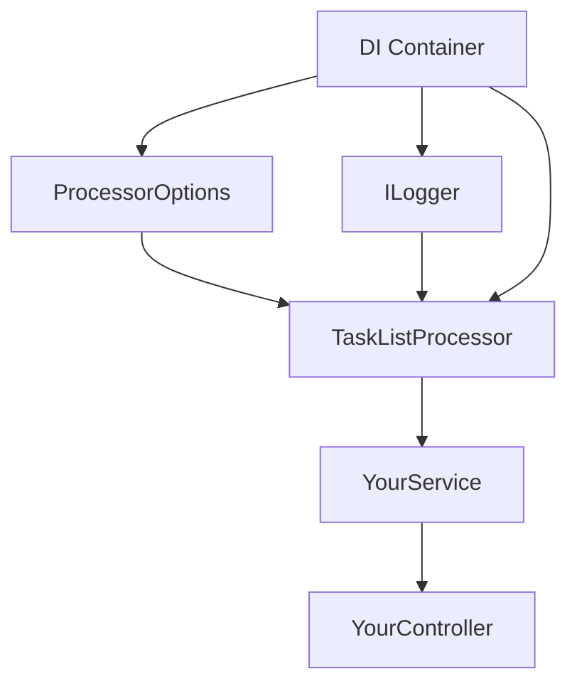

# Tutorial: Dependency Injection with TaskListProcessor

**Level**: Intermediate  
**Duration**: 30 minutes  
**Prerequisites**:
- Completed all [Beginner Tutorials](../beginner/01-simple-task-execution.md)
- Understanding of Dependency Injection concepts
- Familiarity with Microsoft.Extensions.DependencyInjection

---

## ?? What You'll Learn

By the end of this tutorial, you'll be able to:

- ? Register TaskListProcessor in DI container
- ? Inject processors into services and controllers
- ? Configure processor options via DI
- ? Use scoped services within tasks
- ? Implement factory patterns for dynamic processors
- ? Best practices for DI with async processors

---

## ?? Why Dependency Injection?

### Benefits

**Testability**
- Easy to mock dependencies for unit testing
- Isolate components for focused testing

**Maintainability**
- Single responsibility principle
- Clear dependency declarations
- Easier to refactor

**Flexibility**
- Swap implementations without changing consumers
- Configure behavior through options
- Support multiple instances with different configurations

**Lifecycle Management**
- DI container manages object lifetime
- Proper disposal handling
- Scope-aware dependencies

---

## ??? Architecture Overview



---

## ?? Step-by-Step Tutorial

### Step 1: Set Up ASP.NET Core Project

Create a new Web API project:

```bash
dotnet new webapi -n TaskProcessorApi
cd TaskProcessorApi
dotnet add package TaskListProcessor
dotnet add package Microsoft.Extensions.DependencyInjection
```

### Step 2: Configure Services

In `Program.cs`, register the processor:

```csharp
using TaskListProcessor;

var builder = WebApplication.CreateBuilder(args);

// Add services to the container
builder.Services.AddControllers();
builder.Services.AddEndpointsApiExplorer();
builder.Services.AddSwaggerGen();

// Register TaskListProcessor
builder.Services.AddScoped<TaskListProcessorEnhanced>(sp =>
{
    var logger = sp.GetRequiredService<ILogger<TaskListProcessorEnhanced>>();
    return new TaskListProcessorEnhanced("DI Processor", logger);
});

// Register your custom services
builder.Services.AddScoped<IDataService, DataService>();
builder.Services.AddScoped<INotificationService, NotificationService>();

var app = builder.Build();

if (app.Environment.IsDevelopment())
{
    app.UseSwagger();
    app.UseSwaggerUI();
}

app.UseHttpsRedirection();
app.UseAuthorization();
app.MapControllers();
app.Run();
```

**Key Points**:
- Use `AddScoped` for per-request lifetime (recommended for web apps)
- Use `AddSingleton` for long-lived, thread-safe processors
- Use `AddTransient` for lightweight, stateless processors

### Step 3: Create Service Interfaces

Define your business services:

```csharp
// IDataService.cs
public interface IDataService
{
    Task<string> FetchDataAsync(int id, CancellationToken ct);
    Task<bool> SaveDataAsync(string data, CancellationToken ct);
}

// INotificationService.cs
public interface INotificationService
{
    Task SendNotificationAsync(string message, CancellationToken ct);
}
```

### Step 4: Implement Services

```csharp
// DataService.cs
public class DataService : IDataService
{
    private readonly ILogger<DataService> _logger;
    private readonly HttpClient _httpClient;

    public DataService(ILogger<DataService> logger, IHttpClientFactory httpClientFactory)
    {
        _logger = logger;
        _httpClient = httpClientFactory.CreateClient();
    }

    public async Task<string> FetchDataAsync(int id, CancellationToken ct)
    {
        _logger.LogInformation("Fetching data for ID: {Id}", id);
        await Task.Delay(100, ct); // Simulate API call
        return $"Data for ID {id}";
    }

    public async Task<bool> SaveDataAsync(string data, CancellationToken ct)
    {
        _logger.LogInformation("Saving data: {Data}", data);
        await Task.Delay(150, ct); // Simulate save
        return true;
    }
}

// NotificationService.cs
public class NotificationService : INotificationService
{
    private readonly ILogger<NotificationService> _logger;

    public NotificationService(ILogger<NotificationService> logger)
    {
        _logger = logger;
    }

    public async Task SendNotificationAsync(string message, CancellationToken ct)
    {
        _logger.LogInformation("Sending notification: {Message}", message);
        await Task.Delay(50, ct); // Simulate notification
    }
}
```

### Step 5: Create Business Logic Service

```csharp
// OrderProcessingService.cs
public class OrderProcessingService
{
    private readonly TaskListProcessorEnhanced _processor;
    private readonly IDataService _dataService;
    private readonly INotificationService _notificationService;
    private readonly ILogger<OrderProcessingService> _logger;

    public OrderProcessingService(
        TaskListProcessorEnhanced processor,
        IDataService dataService,
        INotificationService notificationService,
        ILogger<OrderProcessingService> logger)
    {
        _processor = processor;
        _dataService = dataService;
        _notificationService = notificationService;
        _logger = logger;
    }

    public async Task<Dictionary<string, TaskResult>> ProcessOrderAsync(
        int orderId,
        CancellationToken ct = default)
    {
        _logger.LogInformation("Processing order {OrderId}", orderId);

        // Define tasks that use injected dependencies
        var tasks = new Dictionary<string, Func<CancellationToken, Task<object?>>>
        {
            ["FetchOrderData"] = async token =>
            {
                return await _dataService.FetchDataAsync(orderId, token);
            },

            ["ValidateOrder"] = async token =>
            {
                await Task.Delay(100, token);
                return new { IsValid = true, ValidationTime = DateTime.UtcNow };
            },

            ["CalculateTotal"] = async token =>
            {
                await Task.Delay(50, token);
                return new { Total = 199.99m, Tax = 19.99m };
            },

            ["SendConfirmation"] = async token =>
            {
                await _notificationService.SendNotificationAsync(
                    $"Order {orderId} confirmed",
                    token);
                return "Notification sent";
            },

            ["UpdateInventory"] = async token =>
            {
                var data = $"Inventory updated for order {orderId}";
                await _dataService.SaveDataAsync(data, token);
                return data;
            }
        };

        // Execute all tasks concurrently
        var results = await _processor.ProcessTasksAsync(tasks, ct);

        _logger.LogInformation(
            "Order {OrderId} processing completed. Success: {SuccessCount}/{TotalCount}",
            orderId,
            results.Values.Count(r => r.IsSuccess),
            results.Count);

        return results;
    }
}
```

### Step 6: Create API Controller

```csharp
// OrdersController.cs
[ApiController]
[Route("api/[controller]")]
public class OrdersController : ControllerBase
{
    private readonly OrderProcessingService _orderService;
    private readonly ILogger<OrdersController> _logger;

    public OrdersController(
        OrderProcessingService orderService,
        ILogger<OrdersController> logger)
    {
        _orderService = orderService;
        _logger = logger;
    }

    [HttpPost("{orderId}/process")]
    [ProducesResponseType(typeof(OrderProcessingResponse), 200)]
    [ProducesResponseType(400)]
    public async Task<IActionResult> ProcessOrder(
        int orderId,
        CancellationToken ct)
    {
        try
        {
            _logger.LogInformation("API request to process order {OrderId}", orderId);

            var results = await _orderService.ProcessOrderAsync(orderId, ct);

            var response = new OrderProcessingResponse
            {
                OrderId = orderId,
                Success = results.Values.All(r => r.IsSuccess),
                Tasks = results.ToDictionary(
                    kvp => kvp.Key,
                    kvp => new TaskInfo
                    {
                        Status = kvp.Value.Status.ToString(),
                        Duration = kvp.Value.Duration,
                        Result = kvp.Value.Result?.ToString()
                    })
            };

            return Ok(response);
        }
        catch (OperationCanceledException)
        {
            _logger.LogWarning("Order processing cancelled for {OrderId}", orderId);
            return StatusCode(499, "Request cancelled");
        }
        catch (Exception ex)
        {
            _logger.LogError(ex, "Error processing order {OrderId}", orderId);
            return StatusCode(500, "Internal server error");
        }
    }
}

public record OrderProcessingResponse
{
    public int OrderId { get; init; }
    public bool Success { get; init; }
    public Dictionary<string, TaskInfo> Tasks { get; init; } = new();
}

public record TaskInfo
{
    public string Status { get; init; } = string.Empty;
    public long Duration { get; init; }
    public string? Result { get; init; }
}
```

### Step 7: Register All Services

Update `Program.cs` to register all services:

```csharp
// Add HttpClient factory
builder.Services.AddHttpClient();

// Register all services
builder.Services.AddScoped<IDataService, DataService>();
builder.Services.AddScoped<INotificationService, NotificationService>();
builder.Services.AddScoped<OrderProcessingService>();

// Register TaskListProcessor
builder.Services.AddScoped<TaskListProcessorEnhanced>(sp =>
{
    var logger = sp.GetRequiredService<ILogger<TaskListProcessorEnhanced>>();
    return new TaskListProcessorEnhanced("Order Processor", logger);
});
```

---

## ?? Advanced Patterns

### Pattern 1: Factory for Multiple Processors

When you need different processors for different scenarios:

```csharp
// IProcessorFactory.cs
public interface IProcessorFactory
{
    TaskListProcessorEnhanced CreateProcessor(string name);
}

// ProcessorFactory.cs
public class ProcessorFactory : IProcessorFactory
{
    private readonly IServiceProvider _serviceProvider;

    public ProcessorFactory(IServiceProvider serviceProvider)
    {
        _serviceProvider = serviceProvider;
    }

    public TaskListProcessorEnhanced CreateProcessor(string name)
    {
        var logger = _serviceProvider.GetRequiredService<ILogger<TaskListProcessorEnhanced>>();
        return new TaskListProcessorEnhanced(name, logger);
    }
}

// Register factory
builder.Services.AddSingleton<IProcessorFactory, ProcessorFactory>();

// Usage in service
public class MultiProcessorService
{
    private readonly IProcessorFactory _factory;

    public MultiProcessorService(IProcessorFactory factory)
    {
        _factory = factory;
    }

    public async Task ProcessHighPriorityAsync()
    {
        using var processor = _factory.CreateProcessor("High Priority");
        // Use processor...
    }

    public async Task ProcessLowPriorityAsync()
    {
        using var processor = _factory.CreateProcessor("Low Priority");
        // Use processor...
    }
}
```

### Pattern 2: Options Pattern

Configure processor behavior through options:

```csharp
// ProcessorOptions.cs
public class ProcessorOptions
{
    public string Name { get; set; } = "Default Processor";
    public int MaxConcurrency { get; set; } = 10;
    public TimeSpan Timeout { get; set; } = TimeSpan.FromSeconds(30);
    public bool EnableTelemetry { get; set; } = true;
}

// Configure options
builder.Services.Configure<ProcessorOptions>(
    builder.Configuration.GetSection("Processor"));

// Use options in factory
builder.Services.AddScoped<TaskListProcessorEnhanced>(sp =>
{
    var options = sp.GetRequiredService<IOptions<ProcessorOptions>>().Value;
    var logger = sp.GetRequiredService<ILogger<TaskListProcessorEnhanced>>();
    
    return new TaskListProcessorEnhanced(options.Name, logger);
});

// appsettings.json
{
  "Processor": {
    "Name": "Production Processor",
    "MaxConcurrency": 20,
    "Timeout": "00:01:00",
    "EnableTelemetry": true
  }
}
```

### Pattern 3: Scoped Service Resolution

Access scoped services within task factories:

```csharp
public class ScopedTaskService
{
    private readonly IServiceScopeFactory _scopeFactory;
    private readonly TaskListProcessorEnhanced _processor;

    public ScopedTaskService(
        IServiceScopeFactory scopeFactory,
        TaskListProcessorEnhanced processor)
    {
        _scopeFactory = scopeFactory;
        _processor = processor;
    }

    public async Task ProcessWithScopedServicesAsync()
    {
        var tasks = new Dictionary<string, Func<CancellationToken, Task<object?>>>
        {
            ["Task1"] = async ct =>
            {
                // Create a new scope for this task
                using var scope = _scopeFactory.CreateScope();
                var dataService = scope.ServiceProvider.GetRequiredService<IDataService>();
                
                return await dataService.FetchDataAsync(1, ct);
            },

            ["Task2"] = async ct =>
            {
                using var scope = _scopeFactory.CreateScope();
                var dataService = scope.ServiceProvider.GetRequiredService<IDataService>();
                var notificationService = scope.ServiceProvider.GetRequiredService<INotificationService>();
                
                var data = await dataService.FetchDataAsync(2, ct);
                await notificationService.SendNotificationAsync(
                    $"Fetched: {data}", ct);
                
                return data;
            }
        };

        await _processor.ProcessTasksAsync(tasks);
    }
}

// Register with scope factory
builder.Services.AddScoped<ScopedTaskService>();
```

---

## ?? Testing with DI

### Unit Testing with Mocked Dependencies

```csharp
using Moq;
using Xunit;

public class OrderProcessingServiceTests
{
    [Fact]
    public async Task ProcessOrderAsync_WithValidOrder_CompletesSuccessfully()
    {
        // Arrange
        var mockDataService = new Mock<IDataService>();
        mockDataService
            .Setup(x => x.FetchDataAsync(It.IsAny<int>(), It.IsAny<CancellationToken>()))
            .ReturnsAsync("Test Data");

        var mockNotificationService = new Mock<INotificationService>();
        mockNotificationService
            .Setup(x => x.SendNotificationAsync(
                It.IsAny<string>(), 
                It.IsAny<CancellationToken>()))
            .Returns(Task.CompletedTask);

        var logger = Mock.Of<ILogger<TaskListProcessorEnhanced>>();
        var processor = new TaskListProcessorEnhanced("Test", logger);

        var serviceLogger = Mock.Of<ILogger<OrderProcessingService>>();
        var service = new OrderProcessingService(
            processor,
            mockDataService.Object,
            mockNotificationService.Object,
            serviceLogger);

        // Act
        var results = await service.ProcessOrderAsync(123);

        // Assert
        Assert.All(results.Values, r => Assert.True(r.IsSuccess));
        mockDataService.Verify(x => 
            x.FetchDataAsync(123, It.IsAny<CancellationToken>()), Times.Once);
        mockNotificationService.Verify(x => 
            x.SendNotificationAsync(It.IsAny<string>(), It.IsAny<CancellationToken>()), 
            Times.Once);
    }
}
```

---

## ?? Best Practices & Pitfalls

### ? DO: Use Appropriate Lifetimes

```csharp
// Web applications: Use Scoped
builder.Services.AddScoped<TaskListProcessorEnhanced>();

// Background services: Use Singleton (if thread-safe)
builder.Services.AddSingleton<TaskListProcessorEnhanced>();

// Short-lived operations: Use Transient
builder.Services.AddTransient<TaskListProcessorEnhanced>();
```

### ? DO: Dispose Properly

```csharp
// In scoped services: DI handles disposal
public class MyService
{
    private readonly TaskListProcessorEnhanced _processor;
    
    public MyService(TaskListProcessorEnhanced processor)
    {
        _processor = processor; // Will be disposed by DI container
    }
}

// In manual creation: Use using statement
using var processor = serviceProvider.GetRequiredService<TaskListProcessorEnhanced>();
```

### ? DON'T: Capture Scoped Services in Singleton

```csharp
// ? WRONG - Memory leak and concurrency issues!
builder.Services.AddSingleton(sp =>
{
    var dataService = sp.GetRequiredService<IDataService>(); // Scoped!
    return new MySingletonService(dataService);
});

// ? CORRECT - Use IServiceScopeFactory
builder.Services.AddSingleton<MySingletonService>();

public class MySingletonService
{
    private readonly IServiceScopeFactory _scopeFactory;

    public MySingletonService(IServiceScopeFactory scopeFactory)
    {
        _scopeFactory = scopeFactory;
    }

    public async Task DoWorkAsync()
    {
        using var scope = _scopeFactory.CreateScope();
        var dataService = scope.ServiceProvider.GetRequiredService<IDataService>();
        // Use scoped service...
    }
}
```

### ? DON'T: Create Processors Manually

```csharp
// ? WRONG - Bypasses DI
var processor = new TaskListProcessorEnhanced("Manual", null);

// ? CORRECT - Use DI
public class MyService
{
    private readonly TaskListProcessorEnhanced _processor;

    public MyService(TaskListProcessorEnhanced processor)
    {
        _processor = processor;
    }
}
```

---

## ?? Complete Working Example

Full `Program.cs` for a minimal API:

```csharp
using Microsoft.Extensions.Logging;
using TaskListProcessor;

var builder = WebApplication.CreateBuilder(args);

// Register services
builder.Services.AddScoped<IDataService, DataService>();
builder.Services.AddScoped<TaskListProcessorEnhanced>(sp =>
{
    var logger = sp.GetRequiredService<ILogger<TaskListProcessorEnhanced>>();
    return new TaskListProcessorEnhanced("API Processor", logger);
});

var app = builder.Build();

app.MapPost("/process/{id}", async (
    int id,
    TaskListProcessorEnhanced processor,
    IDataService dataService,
    CancellationToken ct) =>
{
    var tasks = new Dictionary<string, Func<CancellationToken, Task<object?>>>
    {
        ["Fetch"] = async token => await dataService.FetchDataAsync(id, token),
        ["Process"] = async token =>
        {
            await Task.Delay(100, token);
            return $"Processed {id}";
        }
    };

    var results = await processor.ProcessTasksAsync(tasks, ct);
    return Results.Ok(results);
});

app.Run();

// Minimal implementations
public interface IDataService
{
    Task<string> FetchDataAsync(int id, CancellationToken ct);
}

public class DataService : IDataService
{
    public async Task<string> FetchDataAsync(int id, CancellationToken ct)
    {
        await Task.Delay(50, ct);
        return $"Data for {id}";
    }
}
```

Test it:
```bash
curl -X POST https://localhost:5001/process/123
```

---

## ?? Key Takeaways

? **DI Lifetimes**: Choose appropriate lifetime (Scoped, Singleton, Transient)  
? **Service Resolution**: Inject processors like any other service  
? **Options Pattern**: Configure behavior through appsettings.json  
? **Scoped Services**: Use IServiceScopeFactory for scoped dependencies in tasks  
? **Testing**: Mock dependencies for isolated unit tests  
? **Disposal**: Let DI container handle lifetime management  

---

## ?? What's Next?

**Next Tutorial**: [02-circuit-breaker-pattern.md](02-circuit-breaker-pattern.md)  
Learn how to implement resilient task processing with circuit breaker pattern.

**Related Reading**:
- [Design Principles](../../architecture/design-principles.md)
- [Testing Strategies](../../best-practices/testing-strategies.md)
- [Production Checklist](../../best-practices/production-checklist.md)

---

**Completed**: Intermediate Tutorial 1 - Dependency Injection ?  
**Next**: Intermediate Tutorial 2 - Circuit Breaker Pattern ?
